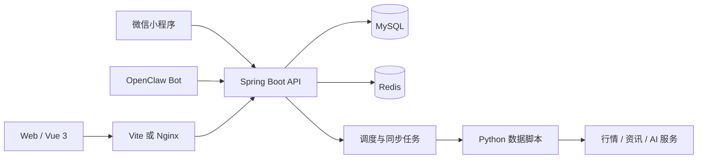

<p align="center">
  
</p>

<h1 align="center">灵极 Apex｜洞见·观变</h1>

<p align="center">
  面向个人投资者的 A 股研究、决策支持、策略回测与模拟交易平台
</p>

<p align="center">
  
  
  
  
  
  
</p>

<p align="center">
  <a href="#核心特性">核心特性</a> ·
  <a href="#快速开始">快速开始</a> ·
  <a href="#系统架构">系统架构</a> ·
  <a href="#开发与测试">开发与测试</a> ·
  <a href="#文档导航">文档导航</a>
</p>

---

## 项目简介

灵极 Apex 将“数据同步 -> 市场研判 -> 选股与决策 -> 策略回测 -> 组合管理 -> 交易复盘”串成一套可追踪的研究工作流。平台优先展示数据日期、覆盖范围、任务状态和失败原因，避免把缺失数据、旧数据或模型推断包装成确定结论。

项目适合个人研究、自托管部署和模拟交易演练，不连接券商实盘下单。行情、资讯和 AI 能力依赖外部数据源及用户自己的配置，任何输出都不构成投资建议。

> [!IMPORTANT]
> 当前项目仍在持续迭代，接口和数据结构可能随业务演进调整。首次部署需要通过受控流程初始化管理员账户，系统不会提供默认管理员密码。

## 核心特性

| 领域 | 能力 |
| --- | --- |
| 市场全景 | A 股指数、涨跌分布、板块热力、资金面、连板天梯、市场资讯与数据新鲜度 |
| 个股研究 | K 线与指标、估值、资金流、题材与行业、风险提示、相关资讯和金融术语解释 |
| 决策支持 | 盘前研报、当日决策、观察池跟踪、持仓风险提示和数据驱动的“小灵”研究助手 |
| 策略研究 | 股票池、策略信号、参数配置、单股/组合回测、基准对比和前向表现跟踪 |
| 资产管理 | 自选分组、组合与持仓、模拟委托、成交记录、收益归因和日终复盘 |
| 数据工程 | 股票、日线、指数、板块、资金、资讯等任务编排，支持进度、日志、缺口和部分成功状态 |
| 多端接入 | Vue Web 应用、微信小程序，以及可选的 OpenClaw HMAC Bot 接口 |
| 用户隔离 | 自选、观察池、组合、模拟盘、回测任务和 AI 会话按用户隔离，共享市场数据统一维护 |

## 技术栈

| 层级 | 主要技术 |
| --- | --- |
| Web 前端 | Vue 3.5、Vite 8、Element Plus、Pinia、Vue Router、Axios、ECharts |
| 后端服务 | Java 17、Spring Boot 3.5、MyBatis-Plus、Sa-Token、SpringDoc OpenAPI |
| 数据与缓存 | MySQL 8、Flyway、Redis 7.4 |
| 数据同步 | Python 3、AKShare 等外部数据源、Spring 定时任务 |
| 工程化 | Maven Wrapper、npm、Docker Compose、Nginx |
| 可选集成 | Moonshot/Kimi 兼容接口、OpenClaw、微信小程序 |

## 系统架构




- 浏览器、小程序和 Bot 只访问 Apex API，不直接连接数据库或第三方数据源。
- MySQL 保存共享市场数据和用户业务数据，Redis 承担会话、缓存与分布式运行状态。
- 同步任务统一记录状态、进度、日志和数据日期；外部源异常时允许明确返回 `PARTIAL`，不将有限结果标记为完整成功。
- 开发环境可直连后端或使用 Vite 代理；生产环境由 Nginx 托管静态资源，并将同源 `/apex` 请求转发到后端。

更完整的模块边界、数据流、用户隔离和部署拓扑见 [架构设计](docs/ARCHITECTURE.md)。

## 仓库结构

```text
apex/
├── apex-be/                 # Spring Boot 后端、Flyway 迁移和后端测试
├── apex-fe/                 # Vue Web 前端、组件和前端测试
├── apex-mini/               # 微信小程序端
├── docs/                    # 架构、操作和 NAS 部署文档
├── integrations/openclaw/   # OpenClaw Skill 与部署配置
├── scripts/market_data/     # 行情、资讯、资金和板块同步脚本
├── docker-compose.yml       # 本地 MySQL 与 Redis
├── docker-compose.prod.yml  # 生产前端、后端与 Redis 编排
└── .env.production.example  # 生产环境变量模板
```

## 快速开始

### 环境要求

- Git
- JDK 17+
- Node.js `^20.19.0` 或 `>=22.12.0`
- Docker Desktop / Docker Compose
- Python 3.10+，仅执行市场数据同步时需要

仓库已包含 Maven Wrapper，本地运行后端不要求预先安装 Maven。

### 1. 获取代码

```bash
git clone https://github.com/aweew/apex.git
cd apex
```

### 2. 启动 MySQL 和 Redis

```bash
docker compose up -d mysql redis
docker compose ps
```

开发 Compose 会创建 `apex` 数据库，并在首次创建数据卷时加载 `apex-be/docs/sql` 下的初始化脚本。本地 MySQL 默认密码为 `apex123`，不得用于生产环境。

### 3. 配置并启动后端

```bash
cp apex-be/src/main/resources/application-local.yml.example \
   apex-be/src/main/resources/application-local.yml

cd apex-be
./mvnw spring-boot:run
```

将 `application-local.yml` 中的数据库密码改为本地实际值；使用上一步默认容器时填写 `apex123`。AI Key 为可选项，不配置时相关能力不可用。

### 4. 启动前端

另开终端，在仓库根目录执行：

```bash
cd apex-fe
npm ci
npm run dev
```

| 服务 | 地址 |
| --- | --- |
| Web 应用 | <http://127.0.0.1:5173/> |
| 后端存活检查 | <http://127.0.0.1:8080/apex/api/health> |
| 后端就绪检查 | <http://127.0.0.1:8080/apex/api/health/ready> |
| Swagger UI | <http://127.0.0.1:8080/apex/swagger-ui.html> |

前端开发环境默认通过 `VITE_API_BASE=http://127.0.0.1:8080/apex` 直连后端。如需验证同源代理，可执行 `VITE_API_BASE=/apex npm run dev`，Vite 会将 `/apex` 转发到本机 `8080` 端口。

### 5. 初始化账户和数据

系统不内置默认管理员密码，也不开放首个管理员的自助注册入口。首次安装需要通过受控流程创建管理员，后续成员使用管理员生成的一次性邀请令牌注册。

登录后建议按以下顺序准备数据：

1. 在“同步”页导入 A 股股票列表和日线，检查最近交易日、覆盖率和缺口。
2. 同步指数、板块、资金面、热点和资讯，补齐市场研究上下文。
3. 按需同步公司概况与基本面数据，先用少量股票验证，再扩大范围。
4. 刷新共享股票池后，再运行信号、策略、回测或智能决策。

任务出现 `PARTIAL`、过期日期或非零缺口时，结果并不完整。应先根据任务日志补跑数据，再解释研究结果。完整流程见 [操作指引](docs/OPERATIONS.md)。

## 配置说明

| 配置 | 位置 | 说明 |
| --- | --- | --- |
| 本地后端 | `apex-be/src/main/resources/application-local.yml` | 数据库凭据、调度开关和可选 AI 配置，不提交到 Git |
| 本地前端 | `apex-fe/.env.development` | `VITE_API_BASE`，默认指向本机后端 |
| 生产环境 | `.env.production` | 从 `.env.production.example` 复制，保存 MySQL、Redis、JWT、AI 和 Bot 配置 |
| 后端公共默认值 | `apex-be/src/main/resources/application.yml` | 端口、上下文路径、Flyway、SpringDoc 和业务配置默认值 |

生产环境至少必须替换 `MYSQL_PASSWORD`、`REDIS_PASSWORD` 和 `APEX_JWT_SECRET`。不要提交 `.env.production`、`application-local.yml`、API Key、Cookie、Token 或真实持仓导出文件。

## 开发与测试

### 前端

```bash
cd apex-fe
npm test
npm run build
```

### 后端

```bash
cd apex-be
./mvnw test
./mvnw package
```

### 仓库级检查

```bash
git diff --check
bash scripts/deploy-nas.test.sh
docker compose config --quiet
```

上述命令验证源代码、测试和构建配置，不等同于真实运行环境验收。涉及登录权限、行情新鲜度、数据覆盖或定时任务时，还需在已配置的实例中执行 [验收检查](docs/OPERATIONS.md#验收检查)。

## 生产部署

生产编排使用 `docker-compose.prod.yml` 运行前端、后端和 Redis，并复用外部 MySQL。前端默认发布到宿主机 `8088` 端口，后端只在 Docker 网络内提供服务。

```bash
cp .env.production.example .env.production

# 修改所有 change_me 配置后执行
sh scripts/deploy-nas.sh --check
sh scripts/deploy-nas.sh
```

部署前请完成数据库备份、Docker 网络检查、密钥配置和反向代理设置。详细步骤、升级、回滚和排障见 [NAS 部署指南](docs/NAS_DEPLOYMENT.md)。

## 文档导航

| 文档 | 内容 |
| --- | --- |
| [架构设计](docs/ARCHITECTURE.md) | 系统边界、核心数据流、模块划分、存储、安全与部署拓扑 |
| [市场行为信号中心设计](docs/plans/2026-09-03-signal-engine-design.md) | Signal Engine、规则 DSL、生命周期、行为链、回测与分期实施方案 |
| [市场行为信号中心使用指南](docs/SIGNAL_CENTER_GUIDE.md) | 首次使用、页面区域、评分口径、阅读顺序与异常排查 |
| [操作指引](docs/OPERATIONS.md) | 本地初始化、首轮数据准备、日常使用、验收与常见问题 |
| [NAS 部署](docs/NAS_DEPLOYMENT.md) | 生产配置、构建发布、备份恢复和故障排查 |
| [后端说明](apex-be/README.md) | 后端分层、接口域、数据库迁移和构建方式 |
| [前端说明](apex-fe/README.md) | 前端目录、开发命令、API 地址和路由模块 |
| [行情脚本](scripts/market_data/README.md) | Python 同步脚本、依赖和数据口径 |
| [OpenClaw 接入](integrations/openclaw/deployment/README.md) | Bot Skill 的配置、部署和验证 |

## 参与贡献

提交改动前，请先确认修改范围和对应模块，并遵循以下流程：

1. 从 `main` 创建独立分支，保持一个变更只解决一类问题。
2. 优先复用现有模块、DTO 和工具类，不引入与问题无关的抽象或依赖。
3. 为行为变化补充对应测试；前端交互同时检查桌面端和移动端。
4. 提交前执行所属模块测试、构建和 `git diff --check`。
5. Pull Request 说明问题、实现方式、验证证据和已知限制；涉及 UI 时附截图，涉及数据库时说明 Flyway 迁移与回滚边界。

推荐使用语义清晰的提交前缀，例如 `feat:`、`fix:`、`docs:`、`test:` 和 `refactor:`。

## 安全与许可

- 发现安全问题时，不要在公开 Issue 中提交密钥、账户、持仓或漏洞利用细节，应通过仓库维护者提供的私密渠道报告。
- 项目当前未提供 `LICENSE` 文件。公开源代码不自动授予复制、修改或分发权利；对外开放前应先确定并补充合适的开源许可证。
- 市场数据、新闻和 AI 服务可能受各自供应商条款约束，部署者需自行确认数据使用与再分发权限。

## 免责声明

本项目仅供个人研究、教学和模拟交易使用。市场数据可能延迟、缺失或部分失败，历史回测和模型输出不代表未来收益。任何页面、信号、评分、研报或 AI 输出均不构成投资建议，使用者应独立判断并自行承担风险。
