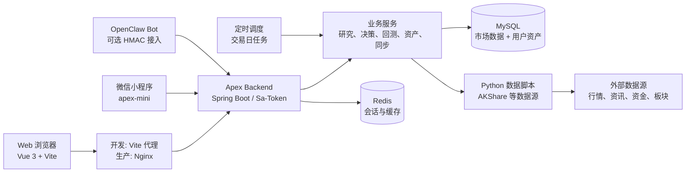
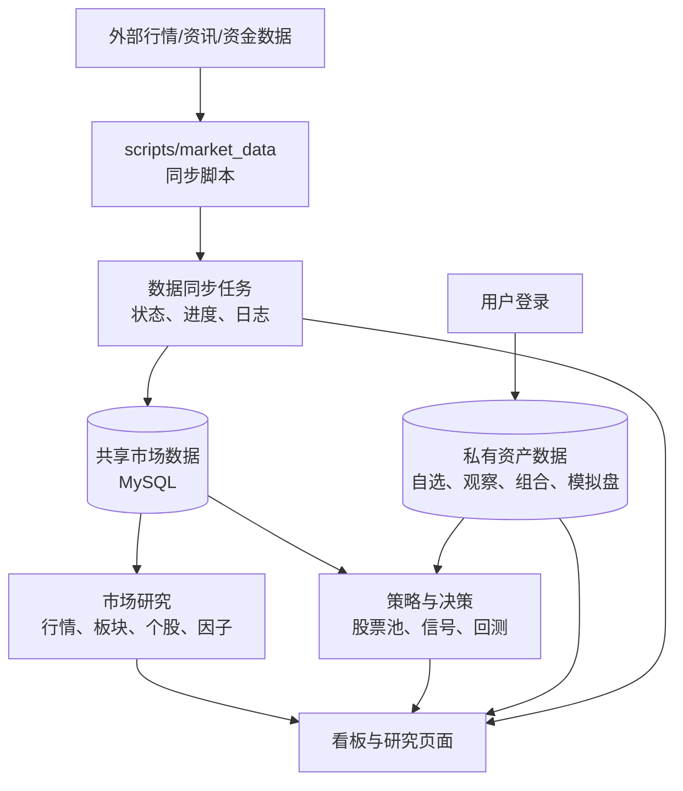

# Apex 架构设计

## 目标与边界

Apex 是 A 股研究、模拟交易和复盘工具。它将外部数据落入本地库，再基于可见的数据覆盖执行市场研究、策略计算和人工决策记录。系统不连接券商下单，也不把回测或 AI 输出视为投资建议。

- 浏览器和小程序只调用 Apex API，不直接访问 MySQL、Redis 或第三方数据源。
- 前端只负责展示、交互和轻量状态；数据同步、策略计算、用户授权和持久化均在后端完成。
- 外部数据源可能超时、限流或缺失。同步状态、数据日期、覆盖率和失败原因必须随结果呈现，不能以旧数据冒充最新数据。
- 真实持仓、组合、自选、观察池、模拟盘、回测任务和 AI 会话按用户隔离；行情、指数、板块、新闻、因子和共享股票池由管理员/系统统一维护后供用户读取。

## 总体架构

开发模式中，Vite 将 `/apex` 代理到 `127.0.0.1:8080`；生产模式中，Nginx 托管前端静态文件，并将同一路径反向代理给后端。因此浏览器始终使用同源的 `/apex` API，不应直接配置 NAS 的后端端口。

## 核心数据流

数据同步任务是市场数据进入业务计算的唯一标准入口。用户可从“同步”页查看任务的 `SUCCESS`、`PARTIAL` 或 `FAIL` 状态；当覆盖不足、日期落后或任务部分失败时，应先补数据再解释策略结果。

## 模块边界

| 领域 | 前端入口 | 后端包/接口域 | 数据归属 |
| --- | --- | --- | --- |
| 认证与账户 | 登录、注册 | `quant.service`、`/api/auth` | 用户账户和权限 |
| 用户资产 | 自选、观察池、组合、模拟盘、交易 | `quant.holding`、`quant.paper`、`/api/watchlist`、`/api/observe`、`/api/portfolio`、`/api/paper` | 用户隔离 |
| 市场数据 | 行情、股票、板块、资金面、连板、资讯 | `quant.market`、`/api/market`、`/api/stock`、`/api/sector`、`/api/news` 等 | 共享 |
| 研究计算 | 股票池、信号、因子、估值、筛选 | `quant.screener`、`quant.strategy`、`quant.factor`、`/api/screener`、`/api/signal` | 共享数据为基础，结果按场景区分 |
| 决策与回测 | 决策、回测、日终、日记 | `quant.decision`、`quant.backtest`、`/api/decision`、`/api/backtest`、`/api/daily` | 回测任务/资产记录按用户隔离；共享市场扫描由管理员维护 |
| 同步与调度 | 同步、数据质量、参数 | `quant.sync`、`quant.job`、`/api/sync`、`/api/data/quality` | 市场任务共享，运行记录可见性受权限控制 |
| 外部接入 | 小程序、OpenClaw | `apex-mini`、`quant.bot`、`/bot/v1` | 显式配置、最小授权 |

## 后端职责划分

后端采用 Controller -> Service -> Mapper 的常规分层。Controller 做接口协议、鉴权和请求校验；Service 编排业务规则、数据新鲜度和跨领域调用；Mapper 负责 MySQL 持久化。`common` 和 `manager` 提供跨领域基础设施，不能反向依赖具体量化页面。

定时任务位于 `quant/job`，仅在 `apex.scheduler.enabled=true` 时执行。任务还会读取系统配置中的 `auto_sync_enabled`，因此“服务启用调度”与“允许自动同步”是两层开关；本地 `application-local.yml` 默认关闭前者，避免开发机意外运行长任务。

## 存储与迁移

| 存储 | 用途 | 运维要点 |
| --- | --- | --- |
| MySQL | 市场数据、任务记录、账户和用户资产 | 生产 MySQL 在 Compose 外部管理；先备份再升级 |
| Redis | Sa-Token 会话和缓存 | 生产必须设置密码并持久化数据卷 |
| `.mx_output` | 同步脚本输出与进度 | 生产映射为持久卷，不能随容器删除 |
| `apex-be/logs` | 后端运行日志 | 生产映射为 `apex-logs` 卷，作为排障证据 |

全新开发库由 `apex-be/docs/sql` 中的初始化脚本创建；既有库由 Flyway 以版本 43 为基线，继续执行 `src/main/java/db/migration` 的 `V44+` Java 迁移。已应用迁移不可改写，任何新结构变更必须新增版本并在目标库核验。

## 安全与权限

- Sa-Token 使用 `Authorization: Bearer <token>`，生产必须设置足够长的 `APEX_JWT_SECRET`。
- 账户创建使用管理员邀请；不提供默认管理员密码，也不应把账号、密码、JWT、AI Key 或 Bot HMAC 凭据写进仓库。
- 生产 Swagger 默认关闭。临时开放后应限制来源并在排障结束后关闭。
- OpenClaw 仅在客户端密钥、用户绑定和 HMAC 校验均配置完成时启用；消息推送通道/接收人未验证前保持关闭。

## 部署拓扑

生产 Compose 包含 `frontend`、`backend`、`redis`。`frontend` 将宿主机 `8088` 映射到容器 `80`；`backend` 只加入内部网络和外部 MySQL Docker 网络，不向 NAS 主机暴露 `8080`。公网上的 HTTP/TLS、域名和重定向属于 DSM 或最外层反向代理，不能通过修改前端容器 Nginx 配置来替代。

详细配置和验证步骤见 [NAS 部署](NAS_DEPLOYMENT.md)。
