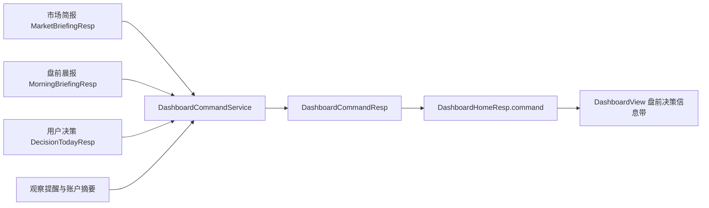

# 看板盘前总结与今日操作指引详细设计

> 状态：待评审
> 日期：2026-08-18
> 范围：Web 看板 `/dashboard`、首页聚合接口 `/api/dashboard/home`、盘前任务调度

## 1. 设计结论

不新增两张彼此孤立的卡片，而是在市场立场下方增加一个完整的「盘前决策」信息带：左侧回答“今天怎么看”，右侧回答“今天怎么做”，现有赚钱效应、隔夜美股、消息面、今日决策和持仓行动继续作为依据与下钻。

核心链路调整为：

```text
市场立场 -> 盘前总结 -> 今日操作指引 -> 盘前依据 -> 个股清单
```

盘前总结是全市场结论，今日操作指引是用户级行动计划。两者必须共享交易日、生成时间、数据截至日和可信状态，不能由前端临时拼接，也不能让大模型直接生成买卖动作。

## 2. 当前问题

当前系统已经具备所需的大部分原始数据，但缺少最后一层决策翻译：

1. `MorningBriefingResp.summary` 只是依次串联美股指数、最强/最弱主题、明星异动和新闻摘要，没有形成面向 A 股开盘的结论。
2. 市场立场已有仓位建议和操作提示，但操作提示位于页面下方「主线与情绪」，首屏无法看到。
3. 今日决策和持仓行动提供个股清单，却没有说明执行顺序、准入条件和失效条件。
4. 页面显示生成时间，但没有同时标明目标交易日和 A 股数据截至日，盘前容易把上一交易日收盘数据误读为当日实时数据。
5. 盘前晨报生成受 Bot 开关控制；看板能力不应依赖是否启用外部通知。
6. 当前智能决策定时任务只在 11:40、15:40、16:10 运行，无法稳定保证开盘前已有当日个股清单。

## 3. 产品目标

### 3.1 用户任务

用户在开盘前 30 秒内完成三件事：

1. 判断今天是进攻、均衡还是防守。
2. 明确先处理风险、等待什么条件、哪些机会可以进入清单。
3. 知道哪些数据是上一交易日收盘数据，哪些是当天早晨新增信息。

### 3.2 成功标准

- 首屏能同时看到盘前结论、目标仓位和前三项行动。
- 每项行动都包含状态、动作、条件或阻断原因，并能下钻到已有页面。
- `RED` 或过期数据不得给出“可执行”状态。
- 交易日 07:15 前，盘前总结可用率不低于 99%；用户级操作指引完整率不低于 95%。
- 桌面 1440px 和移动 390px 下无横向溢出、文字遮挡或内容重叠。

## 4. 范围边界

### 4.1 本期包含

- 看板新增「盘前决策」信息带。
- 结构化盘前总结和用户级操作指引。
- 明确目标交易日、数据截至日、生成时间和状态。
- 交易日前的晨报生成与用户决策调度。
- 旧 `morningBriefing`、`market`、`decision` 响应字段保持兼容。
- 数据缺失、过期、非交易日、清单生成中等降级状态。

### 4.2 本期不包含

- 自动下单或一键执行买卖。
- 大模型直接决定仓位、买卖方向或个股动作。
- 盘前总结单独落库和历史版本管理。
- 新增外部行情源或新闻源。
- 自动识别美股主题到 A 股板块的映射；没有明确映射时只作为隔夜背景展示。

### 4.3 后续增强

- 09:25 后的竞价确认和盘中自动校准。
- 轻量轮询实时更新操作项状态。
- 盘前计划与收盘结果的归因复盘。

## 5. 页面信息架构

页面顺序调整为：

1. 页面标题与总览计数。
2. 市场立场与市场概览，保留现有布局。
3. **盘前决策，新增。**
4. 赚钱效应，保留现有五指标。
5. 盘前依据，由现有「隔夜与今日消息」改名并保留详细内容。
6. 观察池提醒。
7. 今日决策与持仓行动。
8. 主线与情绪、数据可信度等现有内容。

这样先给结论和动作，再给证据与个股清单，避免用户从多块行情数据中自行推导。

## 6. 页面详细设计

### 6.1 桌面布局

```text
┌──────────────────────────── 盘前决策 · 2026-08-18 ────────────────────────────┐
│ 数据正常  A股截至 08-17  决策截至 08-17 15:00  生成 06:52         查看盘前依据 │
├──────────────────────────────────────┬────────────────────────────────────────┤
│ 盘前总结                             │ 今日操作指引                           │
│ 防守基线不变，外盘科技方向有局部修复，│ 总仓 2-4 成      新仓系数 0.55          │
│ 但A股赚钱效应仍弱，开盘不抢。         │ 1 必做  先处理 11 个卖点/止损           │
│                                      │ 2 等待  仅观察主线且可执行的买入候选    │
│ 机会：半导体、机器人                 │ 3 失效  数据转黄/红或立场继续走弱时停手 │
│ 风险：中位数 -1.03%、下跌家数占优    │                         打开今日决策 > │
│ 观察：立场升至均衡后再恢复正常节奏    │                                        │
└──────────────────────────────────────┴────────────────────────────────────────┘
```

布局规则：

- 整体使用现有页面的信息带样式：白色页面、上下分隔线、无悬浮大卡片、无装饰渐变。
- 桌面两列比例为 `minmax(0, 1.15fr) minmax(360px, 0.85fr)`，中间使用 1px 分隔线。
- 整块目标高度 190-230px，不让原始新闻列表占据首屏。
- 标题 15px，盘前结论 17-18px，正文 13px，元数据 11-12px；不使用英雄级字号。
- 红绿只表达 A 股涨跌或风险语义，状态同时显示文字，不能只靠颜色区分。
- 「查看盘前依据」「打开今日决策」使用现有链接按钮样式，不增加高强调主按钮。

### 6.2 盘前总结内容

盘前总结固定包含四层，禁止输出长篇报告：

| 层级 | 展示内容 | 限制 |
|---|---|---|
| 结论 | 对今日市场基线的判断 | 最多 2 行、60 个汉字 |
| 机会 | A 股主线或利好消息主题 | 最多 2 个方向 |
| 风险 | 最重要的市场或消息风险 | 最多 2 个方向 |
| 观察 | 哪个条件会改变当前结论 | 最多 2 条 |

结论必须回答“外部增量信息是否改变现有市场立场”。现有 `market.stance` 是锚点，隔夜美股和新闻只能修饰节奏，不能直接把防守改成进攻。

示例：

- 防守 + 外盘偏弱：`A股防守基线与外盘方向一致，今日先处理风险，等待市场广度修复。`
- 防守 + 外盘偏强：`外盘有修复，但A股赚钱效应仍弱，先观察映射，不抢开盘。`
- 进攻 + 外盘偏弱：`A股基线仍偏强，外盘扰动增加，保留进攻方向但降低开盘节奏。`
- 数据异常：`关键数据不足，盘前结论不可用；补齐数据前只执行风险处置。`

### 6.3 今日操作指引内容

右侧顶部展示结构化仓位门槛：

- 目标总仓区间。
- 新建仓系数。
- 当前执行状态：可执行、等待、阻断或已完成。

下方最多展示 3 项，按以下优先级排序：

1. **风险处置**：卖出清单、止损/止盈、已触发观察项。
2. **新仓计划**：可执行买入数量、主线匹配数量和准入条件。
3. **失效条件**：数据降级、市场立场下调或决策清单缺失时停止新增动作。

每项由“状态 + 标题 + 动作正文 + 条件/原因 + 目标数量”组成。状态语义：

| 状态 | 含义 | 展示 |
|---|---|---|
| `REQUIRED` | 开盘后优先处理 | 红色短标记“必做” |
| `READY` | 条件已满足，可进入清单执行 | 蓝色短标记“可执行” |
| `WAIT` | 尚未满足条件 | 灰蓝短标记“等待” |
| `BLOCKED` | 数据或规则阻断 | 红色短标记“阻断” |
| `DONE` | 当前无待处理项 | 绿色短标记“已清” |

状态不能由新闻摘要或大模型输出，必须由结构化规则确定。

### 6.4 下钻关系

| 操作项代码 | 下钻目标 |
|---|---|
| `RISK_FIRST` | `/portfolio`，并定位持仓行动 |
| `BUY_CONDITIONALLY` | `/decision`，并定位买入清单 |
| `WATCH_ALERTS` | `/observe` |
| `REFRESH_DATA` | `/sync` |
| `VIEW_CONTEXT` | 当前页「盘前依据」锚点 |

后端只返回稳定的操作项代码，前端统一维护路由映射，避免响应中写死页面 URL。

### 6.5 移动布局

- 390px 下改为单列：盘前总结在前，今日操作指引在后。
- 四个时间字段在移动端分两行展示，标签与值不得截断成省略号。
- 机会、风险、观察每项独占一行，最长文本允许换行，不做横向滚动。
- 操作项保持至少 44px 点击区域；状态、标题和数量同一行，说明放下一行。
- 「盘前依据」默认折叠，点击后按市场温度、主题情绪、明星异动、今日消息面顺序展开。
- 不使用固定高度；使用稳定的最小高度和自然换行，避免动态内容覆盖后续区块。

## 7. 交易时段与日期语义

### 7.1 阶段定义

| 阶段代码 | 时间或条件 | 页面文案 |
|---|---|---|
| `PRE_MARKET` | 交易日 00:00-09:29 | 盘前决策 |
| `IN_SESSION` | 交易日 09:30-15:00 | 今日操作指引 |
| `AFTER_CLOSE` | 交易日 15:00 后 | 今日计划与收盘状态 |
| `NON_TRADING_DAY` | 周末或节假日 | 下个交易日准备 |

阶段只改变标题和状态，不修改已生成动作的事实来源。盘中自动校准作为后续增强，不在本期假装实时。

### 7.2 必须展示的四个时间

- `tradeDate`：操作计划对应的目标交易日。
- `marketDataAsOf`：A 股行情与赚钱效应的实际截至日。
- `decisionDataAsOf`：个股决策允许使用的数据截止时间。
- `generatedAt`：盘前决策完成时间。

盘前 `marketDataAsOf` 正常应为 `tradeDate` 的上一交易日；开盘后若仍是上一交易日，状态降为 `PARTIAL`，但不得把数据标成“实时”。

### 7.3 可信状态

| 状态代码 | 判定 | 行为 |
|---|---|---|
| `READY` | 核心数据完整且日期匹配 | 正常展示全部动作 |
| `PARTIAL` | 外盘、新闻或个股决策部分缺失 | 展示可确定部分，缺失项标等待 |
| `STALE` | A 股数据早于预期上一交易日，或晨报不是当前目标交易日 | 禁止新增仓，仅保留风险处置 |
| `BLOCKED` | 市场数据 `RED` 或无法确定目标交易日 | 只展示补数据动作 |
| `GENERATING` | 晨报或用户决策任务仍在运行 | 展示骨架和预计完成状态 |

现有市场简报允许落后三个交易日仍为正常，这对盘前操作过宽。盘前决策必须使用更严格的日期门禁：A 股数据早于目标交易日的上一交易日即为 `STALE`。

## 8. 生成规则

### 8.1 盘前总结

输入优先级：

1. `MarketBriefingResp`：市场立场、评分、仓位建议、赚钱效应、广度、涨跌停、主线、操作提示。
2. `MorningBriefingResp`：隔夜指数、主题情绪、明星异动和新闻快照。
3. `NewsPulseResp`：利好/利空数量、热点主题、重要新闻和摘要来源。

规则顺序：

1. 先执行数据门禁；`RED`、日期过期时直接输出不可用结论。
2. 以 `market.stance` 形成基础结论。
3. 使用隔夜三大指数方向和主题中位数补充外盘扰动，不改变基础立场。
4. 使用新闻利好/利空和主题补充机会、风险方向。
5. 使用赚钱效应、市场广度、涨跌停和现有 `tips` 生成观察条件。
6. 去重并按重要度截断；前端不再自行拼接业务结论。

机会方向只允许来自 A 股主线或消息卡片的显式主题。美股主题没有配置映射时不得自动写成 A 股机会。

### 8.2 仓位结构化

沿用现有评分规则，将文案同时输出为结构化值：

| 条件 | 目标总仓 | 新仓系数 |
|---|---:|---:|
| 数据阻断 | 0%-10% | 0.40 |
| 防守，评分不高于 40 | 20%-40% | 0.55 |
| 均衡，评分 41-64 | 40%-60% | 1.00 |
| 进攻，评分不低于 65 | 60%-80% | 1.10 |

页面继续显示现有仓位文案，但操作指引使用数值字段，禁止从中文中解析百分比。

### 8.3 操作项规则

#### 风险处置

- 决策数据新鲜，且 `sellCount > 0` 或存在数据新鲜的 `TRIGGERED` 观察项：`REQUIRED`。
- 决策数据早于目标交易日的上一交易日：保留风险内容但降为 `WAIT`，要求先复核，不把旧信号标成必做。
- 没有卖点和触发项：`DONE`，文案为“当前无优先风险动作”。
- 市场全局数据异常不隐藏已有持仓风险，但是否标记必做由 `decisionDataAsOf` 决定。

#### 新仓计划

- 状态为 `BLOCKED` 或 `STALE`：`BLOCKED`。
- 今日决策未生成：`WAIT`，引导到同步中心查看任务。
- `executableCount = 0`：`WAIT`，不得把普通买入候选描述成可执行。
- 数据可用且存在可执行候选：`READY`；防守立场同时显示降权系数。

#### 失效条件

- 数据状态从 `READY/PARTIAL` 降为 `STALE/BLOCKED`。
- 市场立场下降一个等级。
- 个股的 `executableHint`、离场规则或风险标记发生变化。

本期失效条件以计划文本展示，后续盘中轮询上线后再动态切换状态。

## 9. 后端数据契约

### 9.1 首页响应扩展

`DashboardHomeResp` 新增普通 DTO 字段：

```java
/**
 * 盘前总结与今日操作指引
 */
private DashboardCommandResp command;
```

不删除或改名现有 `market`、`morningBriefing`、`decision` 字段，旧前端和旧缓存可以继续工作。

### 9.2 DashboardCommandResp

```text
DashboardCommandResp
├── tradeDate              目标交易日
├── marketDataAsOf         A股数据截至日
├── decisionDataAsOf       个股决策数据截止时间
├── generatedAt            生成时间
├── phase                  PRE_MARKET/IN_SESSION/AFTER_CLOSE/NON_TRADING_DAY
├── status                 READY/PARTIAL/STALE/BLOCKED/GENERATING
├── dataLevel              GREEN/YELLOW/RED
├── preMarketSummary       PreMarketSummaryResp
└── operationGuide         TodayOperationGuideResp
```

`PreMarketSummaryResp`：

```text
├── headline               盘前结论
├── opportunityItems       机会方向，最多2项
├── riskItems              风险方向，最多2项
├── evidenceItems          核心依据，最多4项
└── watchConditions        观察/失效条件，最多2项
```

`TodayOperationGuideResp`：

```text
├── summary                行动总述
├── targetPositionMin      目标总仓下限
├── targetPositionMax      目标总仓上限
├── newPositionFactor      新仓系数
├── blockedReason          整体阻断原因
└── items                  OperationGuideItemResp，最多3项
```

`OperationGuideItemResp`：

```text
├── priority               1-3
├── code                   稳定操作代码
├── status                 REQUIRED/READY/WAIT/BLOCKED/DONE
├── title                  短标题
├── actionText             应做什么
├── conditionText          满足条件或阻断原因
├── targetCount            目标数量
└── targetType             POSITION/DECISION/OBSERVE/DATA
```

所有新增 DTO 使用 Lombok 普通类，所有字段添加 Javadoc；不使用 `Map<String, Object>`、`record` 或静态内部类。业务枚举必须包含 `code` 和 `desc`。

### 9.3 示例响应

```json
{
  "command": {
    "tradeDate": "2026-08-18",
    "marketDataAsOf": "2026-08-17",
    "decisionDataAsOf": "2026-08-17T15:00:00",
    "generatedAt": "2026-08-18T06:52:18",
    "phase": "PRE_MARKET",
    "status": "READY",
    "dataLevel": "GREEN",
    "preMarketSummary": {
      "headline": "外盘有局部科技催化，但A股赚钱效应仍弱，防守基线不变，开盘不抢。",
      "opportunityItems": [
        { "name": "半导体", "reason": "主线与利好消息同时出现" }
      ],
      "riskItems": [
        { "name": "市场广度", "reason": "下跌家数明显多于上涨" }
      ],
      "evidenceItems": [
        { "label": "市场立场", "value": "防守 35/100", "signal": "NEGATIVE" },
        { "label": "全A中位数", "value": "-1.03%", "signal": "NEGATIVE" }
      ],
      "watchConditions": [
        { "title": "恢复节奏", "condition": "市场立场升至均衡且数据保持正常" }
      ]
    },
    "operationGuide": {
      "summary": "先处理卖出和止损，再等待可执行买点。",
      "targetPositionMin": 0.20,
      "targetPositionMax": 0.40,
      "newPositionFactor": 0.55,
      "items": [
        {
          "priority": 1,
          "code": "RISK_FIRST",
          "status": "REQUIRED",
          "title": "风险处置",
          "actionText": "优先处理卖出和止损清单",
          "conditionText": "当前有11个卖点",
          "targetCount": 11,
          "targetType": "POSITION"
        },
        {
          "priority": 2,
          "code": "BUY_CONDITIONALLY",
          "status": "WAIT",
          "title": "新仓计划",
          "actionText": "只观察主线匹配且可执行的候选",
          "conditionText": "防守立场，新仓按0.55系数降权",
          "targetCount": 0,
          "targetType": "DECISION"
        }
      ]
    }
  }
}
```

## 10. 服务职责与调用流程

新增独立的 `IDashboardCommandService` / `DashboardCommandServiceImpl`，职责明确为“把已有市场、晨报、用户决策和观察提醒聚合成盘前决策”，不负责重新抓行情或生成新闻。



`DashboardServiceImpl.home()` 在现有并行任务完成后调用该服务。聚合只做内存计算，不查询数据库、不调用外网，因此不会显著增加首页时延。首页现有 15 秒用户级 Redis 缓存继续生效。

不把该逻辑放入 `MorningBriefingServiceImpl`，因为晨报是全局数据，而操作指引依赖用户自己的决策、持仓和观察提醒。

## 11. 调度设计

### 11.1 调度顺序

| 时间 | 任务 | 结果 |
|---|---|---|
| 06:35 | 刷新夜间资讯并生成全局盘前晨报 | `MorningBriefingResp` |
| 06:50 | 为启用用户提交当日智能决策 | `DecisionTodayResp` / `DailyAction` |
| 07:15 前 | 看板按需聚合盘前决策 | `DashboardCommandResp` |

### 11.2 必要调整

- 看板晨报生成与 Bot 通知开关解耦：看板任务按配置独立启用，只有外部推送受 Bot 开关控制。
- 晨报和用户决策在非交易日不生成“今日操作”，页面改为下个交易日准备。
- `MorningBriefingResp` 补充 `tradeDate`，旧字段保持不变；A 股 `marketDataAsOf` 继续取自 `MarketBriefingResp.asOf`。
- 操作指引透传 `DecisionTodayResp.asOfTime` 为 `decisionDataAsOf`，不使用任务完成时间冒充决策数据时间。
- `DecisionScheduler` 增加 06:50 盘前运行时点，沿用现有按用户提交 `DECISION` 任务的机制。
- 06:50 生成的动作日期为当天交易日，`DecisionTodayResp.asOfTime` 必须停在上一交易日收盘或更早，禁止使用任务运行时间冒充数据时间。
- 若 06:50 时晨报尚未完成，用户决策仍可使用上一交易日市场数据；看板状态标记为 `PARTIAL`，晨报完成后自动恢复。

## 12. 降级与异常状态

| 场景 | 盘前总结 | 操作指引 |
|---|---|---|
| A 股数据 `RED` | 显示“数据不足，不形成盘前结论” | 新仓阻断；数据新鲜的持仓风险仍展示 |
| 晨报缺失 | 使用 A 股市场立场生成简版总结 | 外盘和消息相关项标等待 |
| 今日决策缺失 | 总结正常展示 | 风险项按已有持仓信息展示，新仓项等待 |
| 决策任务运行中 | 总结正常展示 | 显示生成中，不重复提交任务 |
| 新闻大模型失败 | 使用现有规则摘要 | 不影响结构化动作 |
| 日期过期 | 明确展示实际截至日 | 只保留风险动作和数据刷新 |
| 非交易日 | 标题改为“下个交易日准备” | 不显示“今日可执行” |
| 接口超时 | 保留浏览器缓存并标记可能过期 | 不沿用旧缓存的可执行状态 |

## 13. 前端状态与交互

- 首次加载超过 300ms 时，盘前总结和三条操作项使用固定骨架占位，避免布局跳动。
- `command` 缺失时兼容旧接口：不显示盘前决策信息带，现有页面保持可用。
- 浏览器缓存键版本升级，防止旧首页缓存被误认为含新契约。
- 点击操作项仅导航，不直接触发交易、同步或重新生成决策。
- 页面滚动到「盘前依据」时保持现有内容顺序；桌面默认展开，移动默认折叠。
- 键盘焦点顺序为盘前总结、操作项 1-3、下钻链接；链接具备可见焦点态。

## 14. 代码影响范围

### 后端

- `DashboardHomeResp.java`：新增 `command` 字段。
- 新增 `DashboardCommandResp`、`PreMarketSummaryResp`、`TodayOperationGuideResp`、`OperationGuideItemResp`、证据/方向/观察条件 DTO。
- 新增带 `code`、`desc` 的阶段、状态、操作项状态和目标类型枚举。
- 新增 `IDashboardCommandService`、`DashboardCommandServiceImpl`。
- `DashboardServiceImpl.java`：聚合已有结果后构建 `command`。
- `MorningBriefingResp.java`：补充目标交易日。
- `MorningBriefingScheduler.java`：解耦看板生成与 Bot 推送开关。
- `DecisionScheduler.java`：增加 06:50 盘前决策任务。

### 前端

- `DashboardView.vue`：新增盘前决策区、状态格式化、操作项路由映射和移动布局。
- 将现有「隔夜与今日消息」标题调整为「盘前依据」，保留原始内容与 `/news` 下钻。
- `dashboardMorningBriefingLayout.test.mjs`：补充结论先于依据、操作项上限、响应兼容和移动单列断言。

本期不新增数据库表和 Flyway 迁移。

## 15. 测试设计

### 15.1 后端单元测试

至少覆盖：

1. 防守 + 外盘偏强时不改变基础立场。
2. 数据 `RED` 时新仓项为 `BLOCKED`。
3. A 股数据早于上一交易日时状态为 `STALE`。
4. 有卖点时风险处置排第一且为 `REQUIRED`。
5. 无卖点和触发提醒时风险处置为 `DONE`。
6. 决策缺失时新仓项为 `WAIT`。
7. 有可执行候选时新仓项为 `READY`，数量正确。
8. 非交易日使用下一交易日，阶段为 `NON_TRADING_DAY`。
9. 晨报缺失时仍能生成 A 股简版总结。
10. 摘要、机会、风险和操作项均按上限截断且去重。
11. 旧决策仍可展示风险内容，但状态不得为 `REQUIRED` 或 `READY`。

### 15.2 聚合与调度测试

- `/api/dashboard/home` 返回新增 `command`，旧字段不变。
- 晨报服务超时不阻断首页主流程。
- 06:50 调度仅在交易日为启用用户提交一次决策任务。
- 盘前决策的动作日期为当天，数据截止时间不晚于上一交易日收盘。
- Bot 关闭时看板晨报仍可生成，通知不发送。

### 15.3 前端自动化与浏览器验收

- 盘前决策位于赚钱效应和盘前依据之前。
- `command` 缺失时页面不报错。
- `READY/PARTIAL/STALE/BLOCKED/GENERATING` 均有文字状态。
- 1440x900、1920x1080、390x844 下无横向滚动或内容重叠。
- 结论 60 字、操作正文 80 字、方向名称 12 字时仍能完整换行。
- 截图验收使用真实填充数据，不能只凭静态测试或构建结果认定视觉通过。

## 16. 验收标准

1. 用户进入看板首屏即可看到盘前结论、目标仓位和前三项操作指引。
2. 页面明确显示目标交易日、A 股数据截至日、决策数据截止时间和生成时间。
3. 数据过期或异常时，页面不会出现“可执行”新仓动作。
4. 操作指引优先展示风险处置，再展示条件新仓，顺序稳定。
5. 每项操作均能下钻到已有业务页面，但不会直接执行交易。
6. 美股或新闻缺失时，A 股市场结论仍可用并明确标记部分数据缺失。
7. Bot 关闭不影响 Web 看板盘前总结生成。
8. 新接口字段向后兼容，旧缓存和旧前端不会因字段新增而失败。
9. 后端专项测试、前端完整测试和生产构建通过。
10. 桌面与移动真实浏览器截图验收通过。

## 17. 实施优先级

### Must

- 盘前决策信息带。
- `DashboardCommandResp` 结构化契约。
- 日期门禁、异常降级和风险优先规则。
- 06:50 用户决策调度。
- Bot 与 Web 晨报生成解耦。
- 后端规则测试、前端布局测试和桌面/移动验收。

### Should

- 移动端盘前依据折叠。
- 操作项锚点定位到目标区块。
- 盘前任务完成率与过期率监控。

### Could

- 竞价确认和盘中动态校准。
- 计划与收盘结果归因。
- 用户自定义仓位区间和操作优先级。
