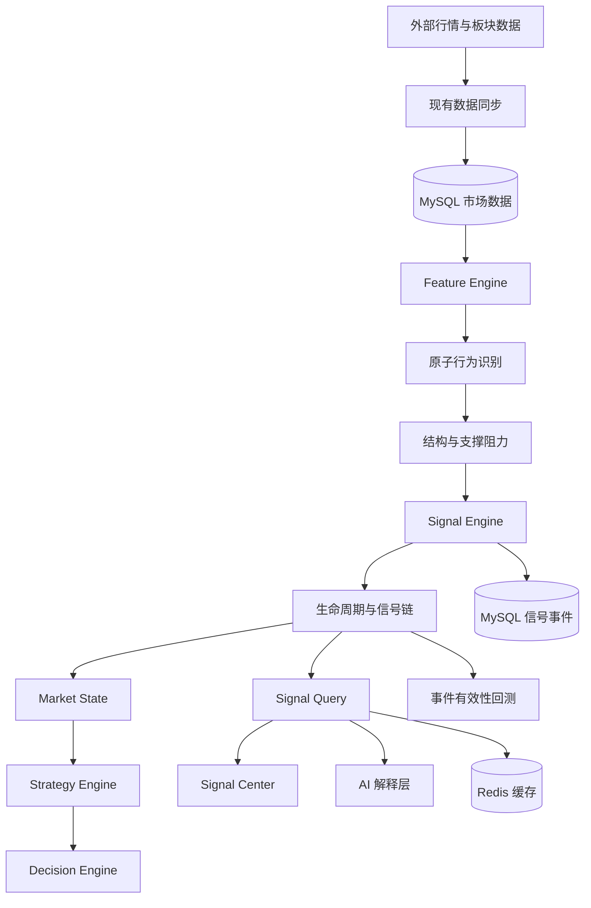
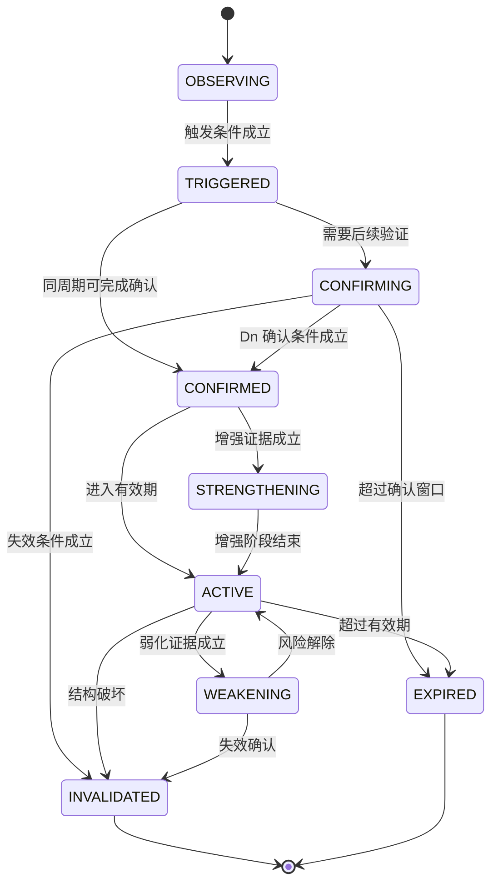
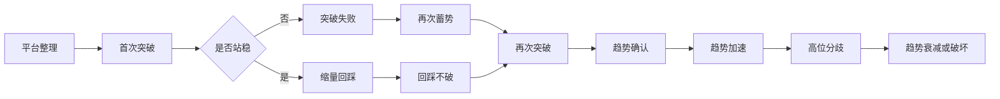
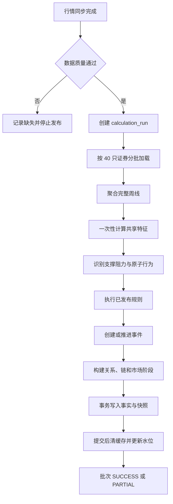
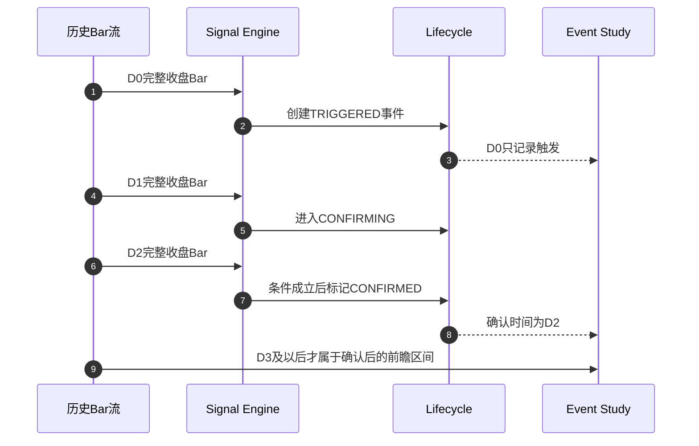

# APEX 市场行为信号中心设计

| 项目 | 内容 |
| --- | --- |
| 文档版本 | V1.0 |
| 状态 | 待评审 |
| 日期 | 2026-09-03 |
| 目标版本 | MVP / V2 / V3 |
| 实施基线 | Java 17、Spring Boot 3.5、MyBatis Plus、MySQL 8、Redis 7、Vue 3 |
| 人力基线 | 单人全栈开发，MVP 14 至 18 周 |

本文是市场行为识别系统的开发基线。文中的默认参数是首轮研究参数，不代表有效性已经得到证明；上线前必须完成滚动样本外验证。系统输出用于研究和模拟交易，不构成投资建议。

## 1. 项目背景

APEX 当前已经具备日线、S1/S2/S3 策略、信号列表、前瞻统计、回测、市场状态、板块数据和模拟交易，但现有信号本质上仍是策略在最新 K 线上返回的一条 `BUY/SELL` 结果：

- `Strategy.evaluate()` 将触发、确认和交易方向合并在同一个返回值中。
- `strategy_signal` 只保存策略、方向、分数和理由，无法表达观察、确认、增强、衰减和失效。
- S3 的“突破放量”使用固定 Java 逻辑，支撑阻力、板块环境和失败历史没有形成统一证据模型。
- 当前前瞻评估能够回答部分收益问题，但不能按信号版本、生命周期阶段和市场环境形成可审计统计。

因此需要在现有策略层之前建立独立的 Signal Engine，把价格、成交量和结构变化转化为有时间、有证据、有版本和有生命周期的市场行为事件。

## 2. 产品目标

### 2.1 核心用户任务

系统需要稳定回答以下问题：

1. 证券当前发生了什么市场行为。
2. 判断依据来自哪些已知价格、成交量、结构和环境数据。
3. 信号当前处于触发、确认、增强、衰减还是失效阶段。
4. 当前行为与此前事件如何组成一条连续的行为链。
5. 相同规则在历史同类环境中的收益分布和失败风险如何。

### 2.2 MVP 可验收目标

- 覆盖全市场股票、主要指数和已有板块的完整日线；周线由日线确定性聚合。
- 实现 S001-S006、W001-W006、确认类和基础风险类信号，规则全部版本化。
- 每个事件均可回溯规则版本、输入截止时间、证据、评分明细和生命周期迁移。
- 5000 只证券的日终增量计算在基准生产环境 15 分钟内完成，单证券失败不阻断全批次。
- 排行榜查询 P95 不超过 300ms，个股信号详情 P95 不超过 500ms，缓存未命中时除外部 AI 解释外不依赖第三方网络。
- 任意回测样本能够证明只使用当时已可见数据，并在下一可交易时点执行。

### 2.3 非目标

- Signal Engine 不直接给出买卖建议、目标仓位或收益承诺。
- MVP 不建设分钟历史库，不接入券商实盘，不引入机器学习。
- MVP 不引入 Spring Cloud、Doris 或 RocketMQ，不为目标架构提前拆微服务。

## 3. 核心设计理念

### 3.1 分层语义

```text
Market Data -> Feature -> Atomic Behavior -> Composite Signal
-> Confirmation -> Lifecycle -> Behavior Chain -> Market State
-> Strategy -> Decision -> AI Explanation
```

- **Signal**：客观描述市场行为，例如“放量突破 60 日阻力”。
- **Strategy**：把一个或多个信号转成入场、退出和仓位规则。
- **Decision**：结合组合风险、市场门控和用户约束形成研究决策。
- **AI**：解释结构化事实，不参与指标计算，也不能修改确定性结果。

### 3.2 设计约束

- 事件而非布尔值：每次信号有稳定 `eventId`、发生时间和状态历史。
- 证据优先：所有分数必须能展开到具体特征、阈值和贡献值。
- 时间可见性优先：所有输入携带 `asOfTime` 和 `dataStatus`。
- 规则与执行分离：DSL 描述条件，Java 引擎负责类型检查、执行和审计。
- 共享与私有分离：市场信号共享计算；订阅、模拟交易和用户视图按用户隔离。

## 4. 总体架构

MVP 采用模块化单体，复用现有同步、日线、板块、回测、决策和 AI 能力。



| 模块 | 输入 | 输出 | 频率 | 历史依赖 | MVP 实时性 | ML | 扩展方式 |
| --- | --- | --- | --- | --- | --- | --- | --- |
| Market Data | 外部行情 | 完整 Bar、板块快照 | 日终 | 是 | 准实时 | 否 | 数据源适配器 |
| Feature Engine | Bar、环境 | 标准化特征 | 每根完整 Bar | 是 | 增量 | 否 | 特征注册表 |
| Indicator Engine | OHLCV | ATR、MA、波动率 | 每根 Bar | 是 | 增量 | 否 | 纯函数 |
| Price Action | Bar、特征 | 新高、新低、影线等 | 每根 Bar | 是 | 增量 | 否 | 原子检测器 |
| Volume Analysis | 量额、换手 | 放量、缩量、效率 | 每根 Bar | 是 | 增量 | 否 | 原子检测器 |
| Support/Resistance | Bar、ATR | 价格带及强度 | 日终 | 是 | 增量重算 | 否 | 结构算法 |
| Pattern Engine | 原子行为、结构 | 平台、回踩、假突破 | 日终 | 是 | 增量 | 否 | DSL 规则 |
| Signal Engine | 特征、模式、环境 | 事件和证据 | 日终 | 是 | 增量 | 否 | 规则版本 |
| Lifecycle/Chain | 新事件、旧快照 | 状态迁移、关系链 | 日终 | 是 | 增量 | 否 | 状态处理器 |
| Market State | 活跃信号链 | 阶段快照 | 日终 | 是 | 增量 | 否 | 状态规则 |
| Backtest | 历史 Bar、规则版本 | 收益分布、稳定性 | 按需 | 是 | 异步 | 否 | 回测执行器 |
| Strategy/Decision/AI | 结构化快照 | 策略、决策、解释 | 按需 | 是 | 查询时 | V3 可选 | 防腐接口 |

## 5. Signal Engine架构

后端新增 `com.awe.apex.quant.signal` 领域，内部按职责分包：

```text
signal/
  definition   规则定义、版本、发布
  feature      特征注册、日线与周线特征
  structure    支撑阻力、平台、摆动点
  rule         JSON AST 校验、编译、执行
  event        事件创建、幂等写入、关系
  lifecycle    状态迁移、确认与失效
  state        个股市场阶段
  query        首页、排行、详情、时间轴
  backtest     事件研究与统计
  integration  旧策略、决策、AI、模拟盘适配
```

核心执行上下文使用普通 Java 对象并由 Lombok 管理字段：

```java
@Data
@Builder
@NoArgsConstructor
@AllArgsConstructor
public class SignalEvaluationContext {
    /** 证券代码 */
    private String symbol;
    /** 证券类型 STOCK/INDEX/SECTOR */
    private String instrumentType;
    /** 周期 DAY/WEEK */
    private String timeframe;
    /** 本次计算可见数据截止时间 */
    private LocalDateTime asOfTime;
    /** 行情是否完整 */
    private Boolean barComplete;
    /** 特征版本 */
    private String featureVersion;
    /** 标准化特征 */
    private SignalFeatureSnapshot featureSnapshot;
}
```

MVP 通过 Spring Bean 和领域接口协作，不通过远程调用。未来拆分服务时仅替换 `SignalQueryPort`、`SignalEventPort`、`SignalStatisticsPort` 三个边界。

## 6. 原子信号体系

### 6.1 Signal Definition

统一定义至少包含：`signalCode`、`signalName`、`signalCategory`、`signalDirection`、`description`、`triggerCondition`、`confirmationCondition`、`invalidCondition`、`strength`、`confidence`、`priority`、`timeframe`、`validPeriod`、`ruleVersion`、`featureVersion`。

| 分类 | MVP 原子行为 | 关键量化口径 |
| --- | --- | --- |
| PRICE | 20/60/120/250 日新高、新低、摆动点突破/跌破 | `close > previousHigh * (1 + threshold)` |
| VOLUME | 放量、缩量、异常量、连续放量/缩量 | `volume / MA(volume,20)` 及历史分位 |
| CANDLE | 大阳/大阴、长上下影、十字、吞没、冲高回落 | 实体、影线除以 `max(ATR14, rangeMedian20)` |
| TREND | 均线方向、斜率变化、加速、乖离 | 归一化线性回归斜率和 ATR 偏离 |
| STRUCTURE | 平台、突破、回踩、假突破、二次突破 | 结构价格带、时间窗口、容忍度 |
| CONTEXT | 指数、板块同步或背离 | 同周期方向、广度和相对强度 |

固定百分比只作为上下限保护，核心阈值使用 ATR、波动率分位和历史分布归一化。停牌 Bar、零成交和不完整 Bar 不参与正式触发。

## 7. 强势信号体系

以下参数均属于规则版本，可在合法范围内回测调整。

| 编码 | 名称 | 默认触发 | 确认/失效 | 默认分值重点 |
| --- | --- | --- | --- | --- |
| S001 | 放量突破 | `close > resistanceUpper + max(0.2*ATR14, 0.3%)`；`volumeRatio20 >= 1.5`；`closePosition >= 0.75` | 3 日内回踩不破或继续创新高；收盘跌回阻力带下沿失效 | 阻力强度、量比、收盘位置、首次突破、环境 |
| S002 | 缩量突破 | 同等价格突破；`volumeRatio20 <= 1.1`；阻力附近卖压效率下降 | 2 日内成交额不恶化且收盘保持上沿之上；放量跌回失效 | 波动收缩、成交效率、上方供给减少 |
| S003 | 平台突破 | 平台 15-60 日；带宽 `<= 4*ATR14`；末 10 日波动率低于 60 日 35 分位；突破上沿 | 5 日内保持平台上沿或完成回踩 | 平台时长、收缩程度、触碰次数 |
| S004 | 突破后回踩不破 | 父事件为突破；1-8 日内最低触及突破带 `[-0.5ATR,+1ATR]`；回踩量比 `<= 0.9` | 回踩后收盘重新站上前一日高点；`close < lower-0.3ATR` 失效 | 父事件质量、回踩深度、缩量、恢复力度 |
| S005 | 二次突破 | 父事件已确认；回踩未失效；收盘超过首次突破后局部高点 `+0.1ATR` | 3 日内不跌回二次突破位 | 首次突破分、回踩分、二次量价效率 |
| S006 | 趋势加速 | MA20/60 向上；20 日斜率高于前 20 日；`volumeRatio20 >= 1.2`；价格偏离扩大 | 连续 2 日推进；乖离过高只增加风险分 | 斜率增量、相对强度、量能、环境 |

参数合法范围：突破阈值 0-1 ATR，量比 1.0-3.0，回踩窗口 2-15 个交易日，跌破容忍 0-1 ATR。超出范围的规则不得发布。

## 8. 弱势信号体系

| 编码 | 名称 | 默认触发 | 强度计算 |
| --- | --- | --- | --- |
| W001 | 多次突破失败 | 15 日内对同一阻力带触碰不少于 3 次，有效站稳次数为 0，失败收盘低于上沿 | 失败次数、放量失败次数、阻力强度、回落幅度 |
| W002 | 努力与结果背离 | `volumeRatio20 >= 1.5` 且 `abs(return)/ATRPercent <= 0.35`，或 3 日累计量能上升而推进效率下降 | 量能投入分位减价格推进分位 |
| W003 | 阻力位放量大阴 | 距阻力 `<= 0.5ATR`；量比 `>=1.5`；实体 `>=0.8ATR`；收盘位置 `<=0.25` | 阻力强度、量比、实体、收盘位置、换手 |
| W004 | 高位放量滞涨 | 5 日内量能斜率为正，价格收益斜率下降，价格位于 60 日区间上部 80% | 量价斜率背离、位置、连续天数 |
| W005 | 冲高回落 | 盘中高点突破结构位，但收盘回到结构位下方；上影 `>=0.6ATR` | 是否阻力位、量比、上影、所处阶段 |
| W006 | 假突破 | 突破事件后 1-5 日收盘跌回突破带下沿 `-0.2ATR`，且未形成回踩恢复 | 跌回幅度、速度、量能和父突破分数 |

“Effort vs Result”统一使用无量纲效率：

```text
effort = percentile(volumeRatio20) * 0.6 + percentile(turnoverRatio20) * 0.4
result = min(1, abs(close - open) / ATR14) * closePositionQuality
divergence = clamp((effort - result) * 100, 0, 100)
```

方向由 K 线位置和结构环境决定，不能仅凭成交量判断吸筹或出货。

## 9. 确认信号体系

确认不是重新命名的原子信号，而是对父事件的后续验证。`signal_confirmation` 必须保存 `parentEventId`、确认类型、观察窗口、实际证据和确认时刻。

| 确认类型 | 确认条件 | 失败条件 |
| --- | --- | --- |
| BREAKOUT_CONFIRMED | 突破后 1-3 日收盘均在突破带之上，或继续创新高 | 收盘有效跌回下沿 |
| RETEST_STARTED | 突破后进入突破位上下 1 ATR 范围 | 超过最大窗口未回踩则到期，不算失败 |
| RETEST_HOLD | 回踩低点不低于下沿减容忍度，且重新转强 | 有效跌破下沿 |
| SUPPORT_CONFIRMED | 触碰支撑后收盘位置大于 0.65，次日不创新低 | 收盘跌破支撑下沿 |
| SECOND_BREAKOUT_CONFIRMED | 已有突破和回踩父链，再突破局部高点 | 再次跌回二次突破位 |
| TREND_CONFIRMED | MA20/60、斜率和相对强度连续 3 日同向 | 任一核心结构被破坏 |
| VOLUME_CONFIRMED | 触发日量能达到阈值且来源完整 | 成交量缺失或异常修订 |
| CONTRACTION_CONFIRMED | 回踩或整理阶段量比连续 2 日低于 0.9 | 放量下跌 |
| FALSE_BREAKOUT_CONFIRMED | 突破后在规定窗口有效跌回且未恢复 | 窗口内重新站回并确认 |
| TREND_DAMAGE_CONFIRMED | 收盘跌破关键支撑，次日仍未收复 | 次日收复并重新确认 |

## 10. 风险信号体系

风险信号描述损失可能性上升，不等于卖出：

| 编码 | 风险 | 触发口径 |
| --- | --- | --- |
| R001 | 过度加速 | 价格距 MA20 大于 `3*ATR14` 或位于 3 年乖离 95 分位 |
| R002 | 高位量价背离 | 价格创新高，5-20 日 OBV/成交量效率未创新高 |
| R003 | 支撑破坏 | 收盘跌破强支撑下沿 `0.3ATR`，次日未收复后确认 |
| R004 | 波动异常 | ATR% 位于 250 日 95 分位且日内振幅扩大 |
| R005 | 流动性不足 | 20 日平均成交额低于配置门槛或停牌/零成交频发 |
| R006 | 环境逆风 | 个股偏强但板块与指数同时走弱，环境分低于 35 |
| R007 | 数据风险 | Bar 不完整、复权版本变化或关键上下文缺失 |

风险分 0-100 独立保存。`R007` 不参与市场方向，但可以把 `confidence` 降到不可发布阈值以下。

## 11. 支撑阻力引擎

### 11.1 识别流程

1. 用左右各 2-5 根 Bar 的局部极值产生摆动点。
2. 使用 `max(0.5*ATR14, price*0.5%)` 作为聚类半径，把相近摆动点聚成价格带。
3. 加入平台上下沿、已确认突破位和 MA20/60/120/250 候选。
4. 按新鲜度、触碰次数、停留时间、反应幅度和成交量异常评分。
5. 当前价上方最近强价格带为阻力，下方最近强价格带为支撑。

```text
levelStrength = 25*touchScore
              + 20*reactionScore
              + 20*recencyScore
              + 15*dwellScore
              + 10*volumeScore
              + 10*sourceDiversityScore
```

各子项归一化到 0-1。相隔少于 3 个交易日的连续触碰只计一次，防止平台内噪声抬高强度。

### 11.2 数据边界

MVP 日线不能还原真实成交量价分布，不输出“筹码密集区”。V2 获得可靠分钟数据后，才能增加 Volume Profile，并在来源字段标记 `MINUTE_VOLUME_PROFILE`。

## 12. Signal Combination

组合规则与原子规则使用同一 JSON AST，但只能引用已经发布的信号快照或上下文特征。

```json
{
  "schemaVersion": "1.0",
  "operator": "AND",
  "conditions": [
    {"signal": "S001", "stateIn": ["CONFIRMED", "ACTIVE"]},
    {"signal": "S004", "stateIn": ["CONFIRMED", "STRENGTHENING"]},
    {"feature": "context.sectorScore", "compare": "GTE", "value": 60},
    {"operator": "NOT", "condition": {"signal": "R003", "stateIn": ["CONFIRMED", "ACTIVE"]}}
  ]
}
```

组合事件保存所有父事件 ID，父事件被修订或失效时重新评估组合，不静默修改历史事件。

## 13. Signal Score

`strengthScore` 表示本次行为达到规则理想形态的程度，范围 0-100：

```text
strength = clamp(base
  + structureContribution
  + priceContribution
  + volumeContribution
  + closePositionContribution
  + contextContribution
  - failurePenalty
  - divergencePenalty
  - extensionPenalty, 0, 100)
```

S001 默认权重：结构 25、突破幅度 10、量能 20、收盘位置 10、趋势 10、板块 10、指数 5、首次突破 10；失败历史最多扣 15、背离最多扣 10、过度乖离最多扣 10。权重总和不要求等于 100，由最终 `clamp` 约束。

等级映射：90-100 极强、80-89 强、70-79 偏强、60-69 中性偏强、40-59 中性、30-39 偏弱、20-29 弱、0-19 极弱。星级只做辅助显示，精确值始终保留。

## 14. Signal Confidence

三类指标必须分别展示：

| 指标 | 含义 | 来源 |
| --- | --- | --- |
| Strength | 当前形态有多典型 | 当前证据及规则权重 |
| Confidence | 当前判断有多可信 | 数据完整度、样本量、参数稳定性、上下文覆盖 |
| Probability | 历史上达到指定收益目标的频率 | 同版本、同环境、同周期事件研究 |

```text
confidence = 0.35*dataCompleteness
           + 0.25*ruleStability
           + 0.20*sampleAdequacy
           + 0.20*contextCompleteness
```

历史样本少于 30 次不展示单点 Probability，只展示“样本不足”；30-99 次同时展示 Wilson 区间；100 次以上才允许用于排名辅助。历史胜率不能反向写入当次 Strength。

## 15. Signal Lifecycle



同一事件同一 `asOfTime` 最多发生一次迁移。终态不可回退；行情修订时创建 `REVISED` 审计关系和新计算版本，不改写已发布历史。

## 16. Signal Chain

`signal_chain` 表示同一证券、周期和结构锚点上的行为演化，`signal_chain_event` 保存事件顺序和角色。



链关联优先使用相同 `structureLevelId`，其次使用相同证券、周期、方向和最大间隔。默认链最大静默间隔为 20 个交易日，超过后新建链。

## 17. Market State

个股阶段枚举：`BASE_BUILDING`、`RANGE_CONSOLIDATION`、`BREAKOUT_ATTEMPT`、`BREAKOUT`、`RETEST_CONFIRMATION`、`TREND_START`、`TREND_ACCELERATION`、`HIGH_LEVEL_DIVERGENCE`、`TREND_DECAY`、`TREND_DAMAGE`、`DOWNTREND`、`UNKNOWN`。

状态由活跃信号链、趋势特征和风险信号共同决定。防守状态优先于进攻状态；证据不足返回 `UNKNOWN`，不得沿用旧状态冒充最新状态。`market_state` 保存主状态、置信度、主要事件 ID、风险事件 ID 和计算时间。

## 18. Multi-Timeframe

MVP 支持 `DAY` 和 `WEEK`：

- 日线只有在收盘同步完成且通过质量检查后才产生正式事件。
- 周线由日线按交易周聚合，开高低收量额遵循确定性 OHLCV 规则。
- 未结束交易周可产生 `OBSERVING` 预览，`barComplete=false`，不进入排名、回测、策略和预警。
- 多周期融合先做上下文加权，不把不同周期事件合并为同一事件。

默认日线权重 0.65、周线权重 0.35；方向冲突时降低 Confidence，不直接抵消 Strength。V2 增加 60/15/5 分钟，V3 再增加 1/30 分钟和月线研究视图。

## 19. Market Regime

复用并扩展现有市场状态思想，Signal Engine 使用独立上下文枚举：`BULL_TREND`、`RANGE`、`BEAR_TREND`、`EXTREME_DOWNTURN`、`HIGH_VOLATILITY`、`LOW_VOLATILITY`、`UNKNOWN`。

市场环境只修正上下文分和 Confidence，不修改原始行为 Strength。首版系数全部保存为配置并通过滚动样本外回测确定；未经验证时系数固定为 1.0。建议搜索范围为 0.70-1.15，任何优化必须保存训练区间、验证区间和参数版本。

## 20. Sector Context

个股上下文由 Stock、Sector、Index 三层构成：

```text
marketContextScore = 0.50*stockRelativeStrength
                   + 0.30*sectorScore
                   + 0.20*indexScore
```

个股到板块使用 `sector_constituent` 最近完整交易日映射；行业优先，概念板块取强度最高且数据完整的前三项加权。缺失板块数据时不按中性 50 填充，而是降低 `contextCompleteness` 并展示缺失原因。

## 21. Signal DSL

### 21.1 DSL 结构

```json
{
  "schemaVersion": "1.0",
  "signalCode": "S001",
  "parameters": {
    "breakoutAtr": {"type": "DECIMAL", "default": 0.2, "min": 0, "max": 1},
    "volumeRatio": {"type": "DECIMAL", "default": 1.5, "min": 1, "max": 3}
  },
  "trigger": {
    "operator": "AND",
    "conditions": [
      {"left": {"feature": "price.close"}, "compare": "GT", "right": {"function": "ADD", "args": [{"feature": "resistance.upper"}, {"function": "MUL", "args": [{"parameter": "breakoutAtr"}, {"feature": "atr.14"}]}]}},
      {"left": {"feature": "volume.ratio.20"}, "compare": "GTE", "right": {"parameter": "volumeRatio"}},
      {"left": {"feature": "candle.closePosition"}, "compare": "GTE", "right": {"value": 0.75}}
    ]
  },
  "confirmation": {"previousSignal": "S001", "withinBars": 3, "conditionRef": "BREAKOUT_HOLD"},
  "invalidation": {"conditionRef": "CLOSE_BELOW_RESISTANCE_LOWER"}
}
```

### 21.2 安全与发布

- 操作符白名单：`AND/OR/NOT/EQ/NE/GT/GTE/LT/LTE/BETWEEN/IN/CROSS_ABOVE/CROSS_BELOW`。
- 函数白名单：`ADD/SUB/MUL/DIV/MIN/MAX/ABS/PERCENTILE/SLOPE/COUNT_TRUE`。
- 特征必须来自注册表并声明类型、周期、最小历史长度和是否允许不完整 Bar。
- 禁止 SpEL、MVEL、JavaScript、SQL 片段、反射和动态类加载。
- 规则状态为 `DRAFT -> VALIDATED -> SHADOW -> ACTIVE -> RETIRED`；已发布版本不可修改，只能复制新版本。
- 灰度按证券哈希桶执行，Shadow 结果独立保存，不进入用户界面和策略。

## 22. 数据模型

### 22.1 核心对象

| 对象 | 主键/标识 | 作用 |
| --- | --- | --- |
| SignalDefinition | `signalCode` | 稳定的业务信号定义 |
| SignalRuleVersion | `definitionId + ruleVersion` | 不可变 DSL 和参数版本 |
| SignalFeatureSnapshot | `symbol + timeframe + asOfTime + featureVersion` | 一次计算使用的标准化特征 |
| SignalEvent | `eventNo` | 一次可审计的市场行为发生实例 |
| SignalConfirmation | `eventId + confirmationCode` | 父事件的后续验证 |
| SignalLifecycleTransition | `eventId + sequenceNo` | 事件状态迁移审计 |
| SignalRelation | `sourceEventId + targetEventId + relationType` | 因果、确认、冲突、修订关系 |
| SignalChain | `chainNo` | 同一结构锚点的连续行为过程 |
| MarketStateSnapshot | `symbol + timeframe + asOfTime` | 当前市场阶段 |
| SupportResistanceLevel | `levelId` | 有宽度、有来源、有状态的价格带 |
| SignalStatistics | 规则、环境、区间、持有期组合 | 历史有效性统计 |

### 22.2 关键枚举

- `instrumentType`：`STOCK/INDEX/SECTOR`。
- `timeframe`：MVP 为 `DAY/WEEK`，V2 扩展分钟周期。
- `direction`：`BULLISH/BEARISH/NEUTRAL/RISK`，不使用 BUY/SELL。
- `dataStatus`：`COMPLETE/PARTIAL/STALE/MISSING/REVISED`。
- `relationType`：`CONFIRMS/INVALIDATES/STRENGTHENS/WEAKENS/PRECEDES/CONFLICTS/REVISES`。
- `levelState`：`CANDIDATE/ACTIVE/BROKEN/RETESTING/INVALIDATED/EXPIRED`。

`signal_event` 保存事实和当前状态，`signal_snapshot` 是查询投影，`signal_lifecycle` 保存完整迁移。查询投影可以重建，不作为唯一事实来源。

## 23. 数据库设计

### 23.1 MySQL 8 DDL

所有新表由新的 Flyway Java 迁移创建。初始化 SQL 同步补充到 `apex-be/docs/sql`；已应用迁移不得改写。

```sql
CREATE TABLE signal_definition (
    id BIGINT NOT NULL AUTO_INCREMENT COMMENT '主键',
    signal_code VARCHAR(32) NOT NULL COMMENT '稳定信号编码',
    signal_name VARCHAR(64) NOT NULL COMMENT '信号名称',
    signal_category VARCHAR(32) NOT NULL COMMENT 'PRICE VOLUME CANDLE TREND STRUCTURE CONTEXT RISK',
    signal_direction VARCHAR(16) NOT NULL COMMENT 'BULLISH BEARISH NEUTRAL RISK',
    description VARCHAR(512) NOT NULL COMMENT '业务定义',
    default_priority INT NOT NULL DEFAULT 50 COMMENT '默认优先级',
    supported_timeframes VARCHAR(128) NOT NULL COMMENT '支持周期JSON数组',
    valid_period_bars INT NOT NULL COMMENT '默认有效Bar数量',
    enabled TINYINT NOT NULL DEFAULT 1 COMMENT '是否启用0否1是',
    create_time DATETIME NOT NULL DEFAULT CURRENT_TIMESTAMP COMMENT '创建时间',
    update_time DATETIME NOT NULL DEFAULT CURRENT_TIMESTAMP ON UPDATE CURRENT_TIMESTAMP COMMENT '更新时间',
    deleted TINYINT NOT NULL DEFAULT 0 COMMENT '逻辑删除',
    PRIMARY KEY (id),
    UNIQUE KEY uk_signal_definition_code (signal_code),
    KEY idx_signal_definition_category (signal_category, enabled, deleted)
) ENGINE=InnoDB DEFAULT CHARSET=utf8mb4 COMMENT='市场行为信号定义';

CREATE TABLE signal_rule (
    id BIGINT NOT NULL AUTO_INCREMENT COMMENT '主键',
    definition_id BIGINT NOT NULL COMMENT '信号定义ID',
    rule_version VARCHAR(32) NOT NULL COMMENT '规则版本',
    schema_version VARCHAR(16) NOT NULL COMMENT 'DSL结构版本',
    rule_json JSON NOT NULL COMMENT '规则AST',
    parameter_json JSON NOT NULL COMMENT '参数定义与快照',
    feature_version VARCHAR(32) NOT NULL COMMENT '特征版本',
    rule_status VARCHAR(16) NOT NULL COMMENT 'DRAFT VALIDATED SHADOW ACTIVE RETIRED',
    rollout_percent INT NOT NULL DEFAULT 0 COMMENT '灰度比例0到100',
    checksum CHAR(64) NOT NULL COMMENT '规则内容SHA256',
    effective_time DATETIME NULL COMMENT '生效时间',
    create_time DATETIME NOT NULL DEFAULT CURRENT_TIMESTAMP COMMENT '创建时间',
    update_time DATETIME NOT NULL DEFAULT CURRENT_TIMESTAMP ON UPDATE CURRENT_TIMESTAMP COMMENT '更新时间',
    deleted TINYINT NOT NULL DEFAULT 0 COMMENT '逻辑删除',
    PRIMARY KEY (id),
    UNIQUE KEY uk_signal_rule_version (definition_id, rule_version),
    UNIQUE KEY uk_signal_rule_checksum (definition_id, checksum),
    KEY idx_signal_rule_status (rule_status, effective_time, deleted)
) ENGINE=InnoDB DEFAULT CHARSET=utf8mb4 COMMENT='信号规则版本';

CREATE TABLE signal_calculation_run (
    id BIGINT NOT NULL AUTO_INCREMENT COMMENT '主键',
    run_no VARCHAR(64) NOT NULL COMMENT '计算批次号',
    trigger_type VARCHAR(16) NOT NULL COMMENT 'SYNC MANUAL BACKFILL REPLAY',
    timeframe VARCHAR(16) NOT NULL COMMENT '计算周期',
    as_of_time DATETIME NOT NULL COMMENT '可见数据截止时间',
    feature_version VARCHAR(32) NOT NULL COMMENT '特征版本',
    rule_set_checksum CHAR(64) NOT NULL COMMENT '规则集合指纹',
    run_status VARCHAR(16) NOT NULL COMMENT 'PENDING RUNNING SUCCESS PARTIAL FAILED',
    total_count INT NOT NULL DEFAULT 0 COMMENT '计划证券数',
    success_count INT NOT NULL DEFAULT 0 COMMENT '成功证券数',
    failure_count INT NOT NULL DEFAULT 0 COMMENT '失败证券数',
    started_at DATETIME NULL COMMENT '开始时间',
    finished_at DATETIME NULL COMMENT '结束时间',
    error_message VARCHAR(1024) NULL COMMENT '批次错误摘要',
    create_time DATETIME NOT NULL DEFAULT CURRENT_TIMESTAMP COMMENT '创建时间',
    update_time DATETIME NOT NULL DEFAULT CURRENT_TIMESTAMP ON UPDATE CURRENT_TIMESTAMP COMMENT '更新时间',
    PRIMARY KEY (id),
    UNIQUE KEY uk_signal_calculation_run_no (run_no),
    KEY idx_signal_calculation_run_query (timeframe, as_of_time, run_status)
) ENGINE=InnoDB DEFAULT CHARSET=utf8mb4 COMMENT='信号计算批次';

CREATE TABLE signal_chain (
    id BIGINT NOT NULL AUTO_INCREMENT COMMENT '主键',
    chain_no VARCHAR(64) NOT NULL COMMENT '行为链编号',
    instrument_type VARCHAR(16) NOT NULL COMMENT '证券类型',
    symbol VARCHAR(32) NOT NULL COMMENT '证券代码',
    timeframe VARCHAR(16) NOT NULL COMMENT '周期',
    chain_direction VARCHAR(16) NOT NULL COMMENT '行为链方向',
    structure_level_id BIGINT NULL COMMENT '结构价格带ID',
    chain_type VARCHAR(32) NOT NULL COMMENT '行为链类型',
    current_state VARCHAR(32) NOT NULL COMMENT '当前链状态',
    start_time DATETIME NOT NULL COMMENT '开始时间',
    last_event_time DATETIME NOT NULL COMMENT '最后事件时间',
    end_time DATETIME NULL COMMENT '结束时间',
    summary_json JSON NULL COMMENT '确定性摘要数据',
    chain_version INT NOT NULL DEFAULT 1 COMMENT '链版本',
    create_time DATETIME NOT NULL DEFAULT CURRENT_TIMESTAMP COMMENT '创建时间',
    update_time DATETIME NOT NULL DEFAULT CURRENT_TIMESTAMP ON UPDATE CURRENT_TIMESTAMP COMMENT '更新时间',
    deleted TINYINT NOT NULL DEFAULT 0 COMMENT '逻辑删除',
    PRIMARY KEY (id),
    UNIQUE KEY uk_signal_chain_no (chain_no),
    KEY idx_signal_chain_symbol (instrument_type, symbol, timeframe, current_state, last_event_time)
) ENGINE=InnoDB DEFAULT CHARSET=utf8mb4 COMMENT='市场行为信号链';

CREATE TABLE signal_event (
    id BIGINT NOT NULL AUTO_INCREMENT COMMENT '主键',
    event_no VARCHAR(64) NOT NULL COMMENT '事件编号',
    definition_id BIGINT NOT NULL COMMENT '信号定义ID',
    rule_id BIGINT NOT NULL COMMENT '规则版本ID',
    calculation_run_id BIGINT NOT NULL COMMENT '计算批次ID',
    instrument_type VARCHAR(16) NOT NULL COMMENT '证券类型',
    symbol VARCHAR(32) NOT NULL COMMENT '证券代码',
    timeframe VARCHAR(16) NOT NULL COMMENT '周期',
    trigger_time DATETIME NOT NULL COMMENT '首次触发时间',
    as_of_time DATETIME NOT NULL COMMENT '可见数据截止时间',
    signal_direction VARCHAR(16) NOT NULL COMMENT '信号方向',
    lifecycle_state VARCHAR(24) NOT NULL COMMENT '生命周期状态',
    strength_score DECIMAL(8, 4) NOT NULL COMMENT '行为强度0到100',
    confidence_score DECIMAL(8, 4) NOT NULL COMMENT '置信度0到100',
    probability_value DECIMAL(10, 6) NULL COMMENT '历史条件概率0到1',
    risk_score DECIMAL(8, 4) NOT NULL DEFAULT 0 COMMENT '风险分0到100',
    structure_level_id BIGINT NULL COMMENT '结构价格带ID',
    parent_event_id BIGINT NULL COMMENT '直接父事件ID',
    chain_id BIGINT NULL COMMENT '行为链ID',
    valid_until DATETIME NULL COMMENT '有效截止时间',
    evidence_json JSON NOT NULL COMMENT '结构化证据',
    data_status VARCHAR(16) NOT NULL COMMENT '数据完整状态',
    feature_version VARCHAR(32) NOT NULL COMMENT '特征版本',
    published TINYINT NOT NULL DEFAULT 1 COMMENT '是否对查询发布0否1是',
    create_time DATETIME NOT NULL DEFAULT CURRENT_TIMESTAMP COMMENT '创建时间',
    update_time DATETIME NOT NULL DEFAULT CURRENT_TIMESTAMP ON UPDATE CURRENT_TIMESTAMP COMMENT '更新时间',
    deleted TINYINT NOT NULL DEFAULT 0 COMMENT '逻辑删除',
    PRIMARY KEY (id),
    UNIQUE KEY uk_signal_event_no (event_no),
    UNIQUE KEY uk_signal_event_idempotent (instrument_type, symbol, timeframe, definition_id, rule_id, trigger_time),
    KEY idx_signal_event_rank (trigger_time, timeframe, signal_direction, lifecycle_state, published),
    KEY idx_signal_event_symbol (symbol, timeframe, trigger_time),
    KEY idx_signal_event_chain (chain_id, trigger_time),
    KEY idx_signal_event_run (calculation_run_id)
) ENGINE=InnoDB DEFAULT CHARSET=utf8mb4 COMMENT='市场行为信号事件';

CREATE TABLE signal_snapshot (
    id BIGINT NOT NULL AUTO_INCREMENT COMMENT '主键',
    instrument_type VARCHAR(16) NOT NULL COMMENT '证券类型',
    symbol VARCHAR(32) NOT NULL COMMENT '证券代码',
    timeframe VARCHAR(16) NOT NULL COMMENT '周期',
    definition_id BIGINT NOT NULL COMMENT '信号定义ID',
    event_id BIGINT NOT NULL COMMENT '当前事件ID',
    lifecycle_state VARCHAR(24) NOT NULL COMMENT '当前生命周期状态',
    strength_score DECIMAL(8, 4) NOT NULL COMMENT '当前行为强度',
    confidence_score DECIMAL(8, 4) NOT NULL COMMENT '当前置信度',
    probability_value DECIMAL(10, 6) NULL COMMENT '历史条件概率',
    risk_score DECIMAL(8, 4) NOT NULL DEFAULT 0 COMMENT '当前风险分',
    market_state_id BIGINT NULL COMMENT '市场阶段快照ID',
    snapshot_time DATETIME NOT NULL COMMENT '快照时间',
    freshness_status VARCHAR(16) NOT NULL COMMENT 'FRESH STALE PARTIAL',
    evidence_summary_json JSON NOT NULL COMMENT '查询证据摘要',
    create_time DATETIME NOT NULL DEFAULT CURRENT_TIMESTAMP COMMENT '创建时间',
    update_time DATETIME NOT NULL DEFAULT CURRENT_TIMESTAMP ON UPDATE CURRENT_TIMESTAMP COMMENT '更新时间',
    PRIMARY KEY (id),
    UNIQUE KEY uk_signal_snapshot_current (instrument_type, symbol, timeframe, definition_id),
    KEY idx_signal_snapshot_rank (timeframe, lifecycle_state, strength_score, confidence_score),
    KEY idx_signal_snapshot_event (event_id)
) ENGINE=InnoDB DEFAULT CHARSET=utf8mb4 COMMENT='信号当前查询快照';

CREATE TABLE signal_relation (
    id BIGINT NOT NULL AUTO_INCREMENT COMMENT '主键',
    source_event_id BIGINT NOT NULL COMMENT '源事件ID',
    target_event_id BIGINT NOT NULL COMMENT '目标事件ID',
    relation_type VARCHAR(16) NOT NULL COMMENT '事件关系类型',
    relation_strength DECIMAL(8, 4) NULL COMMENT '关系强度0到100',
    reason_json JSON NOT NULL COMMENT '关系证据',
    create_time DATETIME NOT NULL DEFAULT CURRENT_TIMESTAMP COMMENT '创建时间',
    PRIMARY KEY (id),
    UNIQUE KEY uk_signal_relation (source_event_id, target_event_id, relation_type),
    KEY idx_signal_relation_target (target_event_id, relation_type)
) ENGINE=InnoDB DEFAULT CHARSET=utf8mb4 COMMENT='信号事件关系';

CREATE TABLE signal_confirmation (
    id BIGINT NOT NULL AUTO_INCREMENT COMMENT '主键',
    event_id BIGINT NOT NULL COMMENT '被确认事件ID',
    confirmation_code VARCHAR(32) NOT NULL COMMENT '确认类型编码',
    confirmation_status VARCHAR(16) NOT NULL COMMENT 'OBSERVING CONFIRMED FAILED EXPIRED',
    observation_start_time DATETIME NOT NULL COMMENT '观察开始时间',
    observation_end_time DATETIME NULL COMMENT '计划观察结束时间',
    confirmed_at DATETIME NULL COMMENT '确认时间',
    evidence_json JSON NULL COMMENT '确认或失败证据',
    invalid_reason VARCHAR(256) NULL COMMENT '失败原因',
    create_time DATETIME NOT NULL DEFAULT CURRENT_TIMESTAMP COMMENT '创建时间',
    update_time DATETIME NOT NULL DEFAULT CURRENT_TIMESTAMP ON UPDATE CURRENT_TIMESTAMP COMMENT '更新时间',
    PRIMARY KEY (id),
    UNIQUE KEY uk_signal_confirmation (event_id, confirmation_code),
    KEY idx_signal_confirmation_pending (confirmation_status, observation_end_time)
) ENGINE=InnoDB DEFAULT CHARSET=utf8mb4 COMMENT='信号确认记录';

CREATE TABLE signal_score (
    id BIGINT NOT NULL AUTO_INCREMENT COMMENT '主键',
    event_id BIGINT NOT NULL COMMENT '信号事件ID',
    score_type VARCHAR(16) NOT NULL COMMENT 'STRENGTH CONFIDENCE PROBABILITY RISK CONTEXT',
    raw_score DECIMAL(10, 6) NOT NULL COMMENT '原始分值',
    adjusted_score DECIMAL(10, 6) NOT NULL COMMENT '修正后分值',
    components_json JSON NOT NULL COMMENT '评分贡献明细',
    score_version VARCHAR(32) NOT NULL COMMENT '评分模型版本',
    calculated_at DATETIME NOT NULL COMMENT '计算时间',
    create_time DATETIME NOT NULL DEFAULT CURRENT_TIMESTAMP COMMENT '创建时间',
    PRIMARY KEY (id),
    UNIQUE KEY uk_signal_score (event_id, score_type, score_version),
    KEY idx_signal_score_type (score_type, adjusted_score)
) ENGINE=InnoDB DEFAULT CHARSET=utf8mb4 COMMENT='信号评分明细';

CREATE TABLE signal_lifecycle (
    id BIGINT NOT NULL AUTO_INCREMENT COMMENT '主键',
    event_id BIGINT NOT NULL COMMENT '信号事件ID',
    sequence_no INT NOT NULL COMMENT '事件内迁移序号',
    from_state VARCHAR(24) NULL COMMENT '迁移前状态',
    to_state VARCHAR(24) NOT NULL COMMENT '迁移后状态',
    transition_time DATETIME NOT NULL COMMENT '状态迁移时间',
    as_of_time DATETIME NOT NULL COMMENT '迁移可见数据截止时间',
    reason_code VARCHAR(32) NOT NULL COMMENT '迁移原因编码',
    evidence_json JSON NOT NULL COMMENT '迁移证据',
    calculation_run_id BIGINT NOT NULL COMMENT '计算批次ID',
    create_time DATETIME NOT NULL DEFAULT CURRENT_TIMESTAMP COMMENT '创建时间',
    PRIMARY KEY (id),
    UNIQUE KEY uk_signal_lifecycle_sequence (event_id, sequence_no),
    UNIQUE KEY uk_signal_lifecycle_idempotent (event_id, to_state, as_of_time),
    KEY idx_signal_lifecycle_time (transition_time, to_state)
) ENGINE=InnoDB DEFAULT CHARSET=utf8mb4 COMMENT='信号生命周期迁移';

CREATE TABLE signal_chain_event (
    id BIGINT NOT NULL AUTO_INCREMENT COMMENT '主键',
    chain_id BIGINT NOT NULL COMMENT '行为链ID',
    event_id BIGINT NOT NULL COMMENT '信号事件ID',
    sequence_no INT NOT NULL COMMENT '链内顺序',
    event_role VARCHAR(24) NOT NULL COMMENT 'SETUP TRIGGER CONFIRM STRENGTHEN WARNING INVALIDATE',
    event_time DATETIME NOT NULL COMMENT '事件时间',
    create_time DATETIME NOT NULL DEFAULT CURRENT_TIMESTAMP COMMENT '创建时间',
    PRIMARY KEY (id),
    UNIQUE KEY uk_signal_chain_event (chain_id, event_id),
    UNIQUE KEY uk_signal_chain_sequence (chain_id, sequence_no),
    KEY idx_signal_chain_event_time (event_id, event_time)
) ENGINE=InnoDB DEFAULT CHARSET=utf8mb4 COMMENT='行为链事件明细';

CREATE TABLE market_state (
    id BIGINT NOT NULL AUTO_INCREMENT COMMENT '主键',
    instrument_type VARCHAR(16) NOT NULL COMMENT '证券类型',
    symbol VARCHAR(32) NOT NULL COMMENT '证券代码',
    timeframe VARCHAR(16) NOT NULL COMMENT '周期',
    state_code VARCHAR(32) NOT NULL COMMENT '市场阶段编码',
    confidence_score DECIMAL(8, 4) NOT NULL COMMENT '阶段置信度0到100',
    as_of_time DATETIME NOT NULL COMMENT '可见数据截止时间',
    primary_event_ids JSON NOT NULL COMMENT '主要依据事件ID',
    risk_event_ids JSON NOT NULL COMMENT '风险事件ID',
    evidence_json JSON NOT NULL COMMENT '阶段证据',
    calculation_run_id BIGINT NOT NULL COMMENT '计算批次ID',
    create_time DATETIME NOT NULL DEFAULT CURRENT_TIMESTAMP COMMENT '创建时间',
    PRIMARY KEY (id),
    UNIQUE KEY uk_market_state_snapshot (instrument_type, symbol, timeframe, as_of_time),
    KEY idx_market_state_query (symbol, timeframe, as_of_time),
    KEY idx_market_state_rank (state_code, timeframe, confidence_score)
) ENGINE=InnoDB DEFAULT CHARSET=utf8mb4 COMMENT='证券市场阶段快照';

CREATE TABLE support_resistance (
    id BIGINT NOT NULL AUTO_INCREMENT COMMENT '主键',
    instrument_type VARCHAR(16) NOT NULL COMMENT '证券类型',
    symbol VARCHAR(32) NOT NULL COMMENT '证券代码',
    timeframe VARCHAR(16) NOT NULL COMMENT '周期',
    level_type VARCHAR(16) NOT NULL COMMENT 'SUPPORT RESISTANCE PIVOT PLATFORM BREAKOUT',
    lower_price DECIMAL(16, 4) NOT NULL COMMENT '价格带下沿',
    upper_price DECIMAL(16, 4) NOT NULL COMMENT '价格带上沿',
    center_price DECIMAL(16, 4) NOT NULL COMMENT '价格带中心',
    strength_score DECIMAL(8, 4) NOT NULL COMMENT '价格带强度0到100',
    touch_count INT NOT NULL DEFAULT 0 COMMENT '有效触碰次数',
    breakout_count INT NOT NULL DEFAULT 0 COMMENT '有效突破次数',
    failure_count INT NOT NULL DEFAULT 0 COMMENT '失败次数',
    source_types VARCHAR(256) NOT NULL COMMENT '来源类型JSON数组',
    detection_start_time DATETIME NOT NULL COMMENT '识别窗口开始时间',
    detection_end_time DATETIME NOT NULL COMMENT '识别窗口结束时间',
    valid_from DATETIME NOT NULL COMMENT '生效时间',
    valid_to DATETIME NULL COMMENT '失效时间',
    level_state VARCHAR(16) NOT NULL COMMENT '价格带状态',
    as_of_time DATETIME NOT NULL COMMENT '可见数据截止时间',
    feature_version VARCHAR(32) NOT NULL COMMENT '特征版本',
    create_time DATETIME NOT NULL DEFAULT CURRENT_TIMESTAMP COMMENT '创建时间',
    update_time DATETIME NOT NULL DEFAULT CURRENT_TIMESTAMP ON UPDATE CURRENT_TIMESTAMP COMMENT '更新时间',
    PRIMARY KEY (id),
    KEY idx_support_resistance_current (instrument_type, symbol, timeframe, level_state, as_of_time),
    KEY idx_support_resistance_price (symbol, timeframe, center_price)
) ENGINE=InnoDB DEFAULT CHARSET=utf8mb4 COMMENT='支撑阻力价格带';

CREATE TABLE signal_backtest (
    id BIGINT NOT NULL AUTO_INCREMENT COMMENT '主键',
    job_no VARCHAR(64) NOT NULL COMMENT '回测任务编号',
    user_id BIGINT NOT NULL COMMENT '所属用户ID',
    definition_id BIGINT NOT NULL COMMENT '信号定义ID',
    rule_id BIGINT NOT NULL COMMENT '规则版本ID',
    timeframe VARCHAR(16) NOT NULL COMMENT '周期',
    market_scope VARCHAR(32) NOT NULL COMMENT '市场范围',
    universe_fingerprint CHAR(64) NOT NULL COMMENT '股票池指纹',
    begin_date DATE NOT NULL COMMENT '统计开始日期',
    end_date DATE NOT NULL COMMENT '统计结束日期',
    hold_horizons_json JSON NOT NULL COMMENT 'T加N观察周期',
    parameter_snapshot_json JSON NOT NULL COMMENT '参数快照',
    regime_filter VARCHAR(32) NULL COMMENT '市场环境过滤',
    job_status VARCHAR(16) NOT NULL COMMENT 'PENDING RUNNING SUCCESS FAILED CANCELLED',
    sample_count INT NOT NULL DEFAULT 0 COMMENT '有效样本数',
    confirmed_count INT NOT NULL DEFAULT 0 COMMENT '确认样本数',
    invalidated_count INT NOT NULL DEFAULT 0 COMMENT '失效样本数',
    leakage_check_status VARCHAR(16) NOT NULL COMMENT '未来函数检查状态',
    started_at DATETIME NULL COMMENT '开始时间',
    finished_at DATETIME NULL COMMENT '结束时间',
    error_message VARCHAR(1024) NULL COMMENT '错误信息',
    create_time DATETIME NOT NULL DEFAULT CURRENT_TIMESTAMP COMMENT '创建时间',
    update_time DATETIME NOT NULL DEFAULT CURRENT_TIMESTAMP ON UPDATE CURRENT_TIMESTAMP COMMENT '更新时间',
    deleted TINYINT NOT NULL DEFAULT 0 COMMENT '逻辑删除',
    PRIMARY KEY (id),
    UNIQUE KEY uk_signal_backtest_job_no (job_no),
    KEY idx_signal_backtest_user (user_id, create_time, deleted),
    KEY idx_signal_backtest_rule (rule_id, begin_date, end_date)
) ENGINE=InnoDB DEFAULT CHARSET=utf8mb4 COMMENT='信号事件有效性回测任务';

CREATE TABLE signal_statistics (
    id BIGINT NOT NULL AUTO_INCREMENT COMMENT '主键',
    definition_id BIGINT NOT NULL COMMENT '信号定义ID',
    rule_id BIGINT NOT NULL COMMENT '规则版本ID',
    timeframe VARCHAR(16) NOT NULL COMMENT '周期',
    market_scope VARCHAR(32) NOT NULL COMMENT '市场范围',
    regime_code VARCHAR(32) NOT NULL DEFAULT 'ALL' COMMENT '市场环境',
    statistic_begin_date DATE NOT NULL COMMENT '统计开始日期',
    statistic_end_date DATE NOT NULL COMMENT '统计结束日期',
    horizon_days INT NOT NULL COMMENT '前瞻交易日数',
    sample_count INT NOT NULL COMMENT '样本数',
    confirmed_count INT NOT NULL COMMENT '确认次数',
    invalidated_count INT NOT NULL COMMENT '失效次数',
    win_count INT NOT NULL COMMENT '正收益次数',
    win_rate DECIMAL(10, 6) NULL COMMENT '胜率',
    average_return DECIMAL(12, 6) NULL COMMENT '平均收益率',
    median_return DECIMAL(12, 6) NULL COMMENT '收益率中位数',
    maximum_return DECIMAL(12, 6) NULL COMMENT '最大收益率',
    maximum_drawdown DECIMAL(12, 6) NULL COMMENT '观察期最大回撤',
    profit_loss_ratio DECIMAL(12, 6) NULL COMMENT '盈亏比',
    confidence_lower DECIMAL(10, 6) NULL COMMENT '胜率置信区间下限',
    confidence_upper DECIMAL(10, 6) NULL COMMENT '胜率置信区间上限',
    backtest_id BIGINT NOT NULL COMMENT '来源回测任务ID',
    calculated_at DATETIME NOT NULL COMMENT '统计计算时间',
    create_time DATETIME NOT NULL DEFAULT CURRENT_TIMESTAMP COMMENT '创建时间',
    PRIMARY KEY (id),
    UNIQUE KEY uk_signal_statistics (rule_id, timeframe, market_scope, regime_code, statistic_begin_date, statistic_end_date, horizon_days),
    KEY idx_signal_statistics_query (definition_id, timeframe, horizon_days, calculated_at)
) ENGINE=InnoDB DEFAULT CHARSET=utf8mb4 COMMENT='信号历史有效性统计';

CREATE TABLE signal_alert_subscription (
    id BIGINT NOT NULL AUTO_INCREMENT COMMENT '主键',
    user_id BIGINT NOT NULL COMMENT '所属用户ID',
    definition_id BIGINT NULL COMMENT '指定信号定义ID',
    signal_category VARCHAR(32) NULL COMMENT '指定信号分类',
    symbol VARCHAR(32) NULL COMMENT '指定证券代码',
    timeframe VARCHAR(16) NOT NULL COMMENT '周期',
    lifecycle_states VARCHAR(256) NOT NULL COMMENT '订阅生命周期状态JSON数组',
    min_strength DECIMAL(8, 4) NOT NULL DEFAULT 0 COMMENT '最低行为强度',
    min_confidence DECIMAL(8, 4) NOT NULL DEFAULT 0 COMMENT '最低置信度',
    channels_json JSON NOT NULL COMMENT '通知渠道配置',
    cooldown_minutes INT NOT NULL DEFAULT 1440 COMMENT '相同事件冷却分钟数',
    enabled TINYINT NOT NULL DEFAULT 1 COMMENT '是否启用0否1是',
    last_triggered_at DATETIME NULL COMMENT '最近触发时间',
    create_time DATETIME NOT NULL DEFAULT CURRENT_TIMESTAMP COMMENT '创建时间',
    update_time DATETIME NOT NULL DEFAULT CURRENT_TIMESTAMP ON UPDATE CURRENT_TIMESTAMP COMMENT '更新时间',
    deleted TINYINT NOT NULL DEFAULT 0 COMMENT '逻辑删除',
    PRIMARY KEY (id),
    KEY idx_signal_alert_user (user_id, enabled, deleted),
    KEY idx_signal_alert_match (definition_id, signal_category, symbol, timeframe, enabled)
) ENGINE=InnoDB DEFAULT CHARSET=utf8mb4 COMMENT='用户信号预警订阅';
```

### 23.2 分区、归档和数据归属

| 表组 | MVP 分区 | 在线保留 | 归档策略 |
| --- | --- | --- | --- |
| 定义、规则 | 不分区 | 永久 | 不删除已发布版本 |
| 事件、生命周期、关系、链 | 不分区 | 5 年 | 按年度导出后软删除，超过 3000 万行评估 Doris |
| 当前快照、支撑阻力 | 不分区 | 当前及最近 1 年 | 可由事实表重建 |
| 市场阶段 | 不分区 | 3 年 | 按年度归档 |
| 回测、统计 | 不分区 | 任务 2 年、聚合永久 | 用户可删除私有任务，公共统计保留 |
| 预警订阅 | 不分区 | 用户有效期 | 注销或用户删除后按隐私策略清理 |

MVP 不启用 MySQL 分区，避免分区键与唯一键约束增加迁移复杂度。事件总量超过 3000 万、统计 P95 连续 7 日超过 2 秒或需要多节点扫描时，把不可变事件明细同步到 Doris，MySQL 继续保存配置、当前状态和用户数据。

旧 `strategy_signal` 保持不变。适配器只把新引擎中被 Strategy 明确采用的事件转换为旧策略信号，不能把所有行为事件写成 BUY/SELL。

## 24. Redis设计

Redis 只保存可丢失、可重建的数据，不保存唯一事实。

| Key | Value | TTL | 更新策略 |
| --- | --- | --- | --- |
| `apex:signal:rule:compiled:{ruleId}` | 已校验的规则执行计划 | 24 小时 | 规则发布主动删除 |
| `apex:signal:overview:{date}:{timeframe}` | 首页聚合响应 | 5 分钟 | 批次发布后删除 |
| `apex:signal:ranking:{date}:{timeframe}:{category}` | 排行榜 ID 列表 | 5 分钟 | 批次发布后删除 |
| `apex:signal:snapshot:{type}:{symbol}:{timeframe}` | 个股当前快照 | 15 分钟 | 快照事务提交后删除 |
| `apex:signal:run:progress:{runNo}` | 批次进度 DTO | 2 小时 | 任务更新覆盖 |
| `apex:signal:lock:{timeframe}:{asOf}` | 分布式批次锁 | 30 分钟 | 完成主动释放，超时兜底 |
| `apex:signal:watermark:{symbol}:{timeframe}` | 最近成功计算水位 | 30 天 | 成功提交后更新 |
| `apex:signal:alert:dedupe:{userId}:{eventId}` | 预警幂等标记 | 订阅冷却期 | 首次发送时写入 |

查询采用 Cache Aside。删除缓存必须发生在 MySQL 事务提交之后；Redis 不可用时查询回源 MySQL，计算任务依赖 MySQL 幂等键继续运行。

## 25. RocketMQ设计

MVP 不引入 RocketMQ，使用现有任务编排、Spring 事务和应用内事件。以下任一条件持续出现时进入 V2 架构评审：

- 5000 只证券日终计算连续 5 个交易日超过 15 分钟。
- 需要两个以上计算实例并行消费。
- 单批失败重放影响在线 API 或 JVM 稳定性。

届时使用 Transactional Outbox，建议 Topic：

| Topic | Key | 生产者 | 消费者 |
| --- | --- | --- | --- |
| `apex.market.bar.completed` | `symbol:timeframe:asOf` | 行情同步 | 特征计算 |
| `apex.signal.feature.ready` | 同上 | 特征计算 | 规则计算 |
| `apex.signal.event.changed` | `eventNo` | 事件服务 | 生命周期、快照、预警 |
| `apex.signal.run.retry` | `runNo:symbol` | 失败处理 | 计算重试 |

消息至少一次投递，消费者依赖数据库唯一键幂等；重试 3 次后进入死信，并将计算批次标记为 `PARTIAL`。消息体只传标识和版本，不传完整历史 Bar。

## 26. Signal计算架构



每个证券在独立事务中写入，批次只负责汇总。规则执行顺序固定为原子行为、结构行为、确认/失效、组合、市场阶段，防止同批次读到尚未落定的随机中间状态。

## 27. 增量计算方案

### 27.1 水位和预热

- 水位维度为 `instrumentType + symbol + timeframe + featureVersion + ruleSetChecksum`。
- 新 Bar 到达时加载 `max(rule.requiredBars) + 20` 根预热 Bar，MVP 上限默认 420 根日线。
- 新规则发布、特征版本变化、行情修订或水位缺失时，从受影响起点执行回放。
- 周线只在交易周结束后推进正式水位；周中预览不更新正式水位。

### 27.2 幂等与失败恢复

- 批次号由 `timeframe + asOfTime + featureVersion + ruleSetChecksum` 生成。
- 事件使用证券、周期、定义、规则版本和触发时间唯一约束。
- 生命周期使用事件、目标状态和 `asOfTime` 唯一约束。
- 失败证券写入批次失败明细和日志，支持按原批次版本重放；重放不能自动升级到新规则。

全量回灌按交易日顺序推进，不能先计算终点快照再反向补生命周期。

## 28. 实时计算方案

MVP 的“准实时”定义为日线收盘数据完整后计算，不承诺盘中信号。交易日建议流程：

1. 15:10 后完成股票、指数和板块日线同步。
2. 数据质量检查确认目标交易日、覆盖率和复权口径。
3. 触发日线批次，成功后聚合本周预览；周最后交易日生成完整周线批次。
4. 发布快照、排行榜和应用内预警。

V2 分钟级采用事件时间窗口和 2 分钟允许迟到；迟到数据只生成修订版本，不静默覆盖已发送预警。盘中 Bar 必须区分 `PARTIAL` 与 `COMPLETE`，只有完整 Bar 可触发正式事件。

## 29. 回测方案

### 29.1 事件有效性研究

事件研究回答“这种行为之后发生了什么”，不是交易收益：

- 逐根 Bar 重放规则、生命周期和市场阶段。
- 记录 T+1、T+3、T+5、T+10、T+20 收益、最大有利变动和最大不利变动。
- 分别统计触发样本、确认样本、失效样本，不能用确认后的结果回填触发日。
- 按市场环境、板块、流动性、年份和强度区间分层。
- 输出样本数、均值、中位数、胜率、Wilson 区间、盈亏比和最大回撤。

### 29.2 策略交易回测

继续复用现有 `BacktestEngine` 的下一交易日开盘执行、成本、滑点、停牌和涨跌停约束。新增 `SignalStrategyAdapter` 只消费当时已经确认的事件。事件研究结果与策略资金曲线分别存储和展示。

### 29.3 参数研究

采用滚动样本外：训练 24 个月、验证 6 个月、步进 3 个月；最近一个完整窗口作为最终保留集。参数选择优先稳定区间，不按单点最高收益选取。涉及 A 股股票池时使用当时可见的上市、ST 和退市状态，避免幸存者偏差。

## 30. 防未来函数



强制规则：

- 特征函数只能读取索引 `<= currentIndex` 的数据。
- 查询接口必须显式传入或解析 `asOfTime`，回测不得调用“最新快照”。
- 确认事件时间等于确认条件实际可知时间，不回填到父事件触发日。
- 日线信号若用于交易，只能在下一可交易时点成交。
- 复权数据保存口径和版本；口径变化必须重跑对应实验。
- 自动测试使用“追加未来 Bar 前后，既有 D0 输出完全相同”作为防泄漏性质测试。

## 31. 性能设计

### 31.1 计算

- OHLCV、ATR、MA、斜率、分位等特征每证券每周期只计算一次，规则引用同一不可变快照。
- 滑动窗口使用滚动和单调队列，避免每根 Bar 重扫完整窗口。
- 延续现有 40 只证券一批的内存边界，基准测试后再调节；不一次加载全市场历史实体。
- 支撑阻力只在新 Bar 或特征版本变化时增量更新，结构失效后保留审计记录。
- 数据库按批写入评分和生命周期，单证券事务失败可重放。

### 31.2 查询与容量

- 排行榜只读 `signal_snapshot` 和最新 `market_state`，不现场扫描事件历史。
- 个股时间轴按 `(symbol,timeframe,trigger_time)` 游标分页，禁止大 offset。
- 首页和排行缓存 5 分钟，当前快照缓存 15 分钟。
- 监控批次耗时、证券 P95 计算耗时、规则命中率、失败率、缓存命中率、查询 P95、事件行数和待确认积压。

容量升级门槛：事件相关表超过 3000 万行、聚合查询 P95 连续 7 日超过 2 秒时引入 Doris；全市场批次连续 5 日超过 15 分钟时评审多实例与 RocketMQ。

## 32. 后端服务拆分

MVP 中以下均为模块化单体内的 Spring Service，不是独立进程：

| 服务 | 核心职责 | 同步/异步 |
| --- | --- | --- |
| SignalDefinitionService | 定义、规则版本、校验、发布 | 同步 |
| SignalFeatureService | 日/周特征与数据完整性 | 批次同步 |
| SupportResistanceService | 结构价格带识别和演化 | 批次同步 |
| SignalCalculationService | 编排规则计算和幂等写入 | 异步任务 |
| SignalEventService | 事件、评分、关系 | 批次同步 |
| SignalLifecycleService | 确认、增强、衰减、失效 | 批次同步 |
| SignalChainService | 行为链和市场阶段 | 批次同步 |
| SignalQueryService | 首页、排行、详情、时间轴 | 在线同步 |
| SignalBacktestService | 事件研究、参数实验、统计 | 异步任务 |
| SignalAlertService | 订阅匹配、去重、投递 | 提交后异步 |
| SignalIntegrationService | 旧策略、Decision、AI、模拟盘适配 | 同步 |

Spring 注入遵循项目字段注入规范，公共和受保护方法添加 Javadoc；业务对象使用明确 DTO/BO/Entity，不用 `Map<String,Object>` 传递核心业务数据。

## 33. API设计

统一前缀 `/api/signal-center`，保留现有 `/api/signal`。

| 方法与路径 | 权限 | 主要请求/响应 |
| --- | --- | --- |
| `GET /overview` | 登录用户 | `tradeDate,timeframe` -> 分类计数、市场阶段分布、数据时间 |
| `GET /rankings` | 登录用户 | 分类、状态、最低分、游标、大小 -> 排行项 |
| `GET /definitions` | 登录用户 | 启用定义及当前规则版本 |
| `GET /stocks/{symbol}` | 登录用户 | 当前状态、活跃信号、风险、支撑阻力、统计 |
| `GET /stocks/{symbol}/timeline` | 登录用户 | `timeframe,cursor,size` -> 生命周期时间轴 |
| `POST /calculations` | 管理员 | 周期、截止时间、范围、触发类型 -> `runNo` |
| `GET /calculations/{runNo}` | 管理员 | 状态、进度、失败摘要 |
| `POST /rules/validate` | 管理员 | DSL -> 类型检查、依赖、最小历史长度 |
| `POST /definitions/{code}/rules` | 管理员 | 新建不可变草稿版本 |
| `POST /rules/{ruleId}/publish` | 管理员 | Shadow/Active 发布配置 |
| `POST /backtests` | 登录用户 | 规则、区间、股票池、持有期 -> `jobNo` |
| `GET /backtests/{jobNo}` | 所属用户 | 进度和事件研究结果 |
| `GET /statistics` | 登录用户 | 规则、周期、环境、持有期 -> 公共统计 |
| `GET/POST/PUT/DELETE /alerts` | 所属用户 | 用户预警订阅 CRUD |

关键响应字段统一包含 `dataAsOf`、`dataStatus`、`featureVersion`、`ruleVersion`。分页大小默认 50、最大 200。常见业务错误：`SIGNAL_DATA_INCOMPLETE`、`SIGNAL_RULE_INVALID`、`SIGNAL_RULE_VERSION_CONFLICT`、`SIGNAL_RUN_DUPLICATE`、`SIGNAL_EVENT_NOT_FOUND`、`SIGNAL_BACKTEST_LEAKAGE_CHECK_FAILED`。

关键 DTO 契约：

| DTO | 必填字段 |
| --- | --- |
| `SignalCalculationReq` | `timeframe`、`asOfTime`、`scopeType`、`triggerType`；指定范围时包含 `symbols` |
| `SignalRankingItemResp` | `eventId`、`symbol`、`name`、`signalCode`、`direction`、`lifecycleState`、`strength`、`confidence`、`riskScore`、`marketState`、`triggerTime`、`dataAsOf` |
| `SignalStockSnapshotResp` | `security`、`timeframe`、`marketState`、`activeSignals`、`riskSignals`、`levels`、`chainSummary`、`statistics`、`freshness` |
| `SignalTimelineItemResp` | `eventId`、`signalCode`、`eventTime`、`fromState`、`toState`、`reasonCode`、`evidence`、`relationEventIds` |
| `SignalBacktestReq` | `ruleId`、`timeframe`、`marketScope`、`beginDate`、`endDate`、`holdHorizons`、`parameterSnapshot` |
| `SignalBacktestResp` | `jobNo`、`status`、`sampleScope`、`leakageCheckStatus`、`horizonStatistics`、`regimeStatistics`、`worstWindows`、`disclaimer` |

创建计算、发布规则和创建回测使用 Bean Validation；日期倒置、未来截止时间、未知特征、参数越界、越权任务均返回业务错误，不进入异步队列。

## 34. 前端页面设计

面向最终用户的操作顺序、区域解释、评分口径和异常排查见 [市场行为信号中心使用指南](../SIGNAL_CENTER_GUIDE.md)。页面必须通过紧凑的帮助入口提供同样的核心解释，避免用户只能阅读研发设计文档才能理解结果。

不新增全局一级菜单，继续使用现有 `/signals` 和 `DecisionWorkspaceTabs`。

### 34.1 信号首页与排行榜

- 首屏显示数据截止时间、计算状态，以及强势、弱势、确认、风险四类摘要。
- 分类使用分段控件，周期使用 DAY/WEEK 切换；筛选包括信号、状态、最低 Strength、最低 Confidence、市场阶段和板块。
- 桌面端使用紧凑表格，移动端使用单层列表项；操作按钮不挤占核心证据。
- 数值分数是主信息，星级仅作辅助；红涨绿跌沿用 APEX 现有约定。

### 34.2 个股详情 `/signals/:code`

- 顶部：证券身份、市场阶段、置信度、数据时间和返回入口。
- 主区：K 线、量能、支撑阻力价格带及事件标记。
- 下区：活跃信号、风险信号、行为链、生命周期时间轴、评分贡献、历史有效性。
- 提供“查看股票研究”“加入观察池”“用策略回测”入口；不直接展示“买入”按钮。

### 34.3 信号回测

同一页面明确分隔“事件有效性”和“策略交易回测”。结果必须同时显示样本数、规则版本、区间、股票池、复权口径、成本口径和免责声明。

所有加载、空数据、部分失败、旧数据和规则已退役状态均有独立呈现。实现时补充 320、390、834 和桌面宽度的结构测试与浏览器截图验收。

## 35. AI解释层

Signal Engine 先输出固定 Schema：

```json
{
  "symbol": "000001",
  "asOfTime": "2026-09-03T15:00:00+08:00",
  "dataStatus": "COMPLETE",
  "marketState": {"code": "TREND_START", "confidence": 87},
  "signals": [{"eventId": 101, "code": "S001", "state": "CONFIRMED", "strength": 92, "confidence": 87}],
  "riskSignals": [],
  "levels": [{"type": "RESISTANCE", "lower": 25.72, "upper": 25.88, "strength": 92}],
  "statistics": {"ruleVersion": "S001_V1", "horizon": 5, "sampleCount": 2184, "winRate": 0.682}
}
```

JSON Schema 校验失败、数据状态不是 `COMPLETE` 或事件证据缺失时，不调用 AI。提示词要求逐条引用事件编码和数值，不允许生成输入中不存在的指标、价格或历史统计。输出经过禁用确定性收益措辞检查，并固定附带研究用途说明。

## 36. 信号预警

MVP 支持应用内预警；已有 Bot 通道仅在配置和接收人验证完成时作为可选渠道。匹配顺序为订阅范围、周期、生命周期、最低 Strength、最低 Confidence、冷却时间。

- 只对 `published=1` 且数据完整的事件发送。
- 同一用户、同一事件、同一生命周期状态只发送一次。
- `WEAKENING` 和 `INVALIDATED` 可作为原事件后续通知，不创建新的交易建议。
- 发送失败记录原因，最多重试 3 次；不能因为通知失败回滚市场事件。
- 用户可以暂停、删除、调整冷却期，并查看触发依据。

## 37. 模拟交易联动

新引擎不直接调用 `PaperService`。联动路径为：

```text
SignalEvent -> SignalStrategyAdapter -> StrategyDecision
-> 用户确认 -> PaperOrder
```

模拟订单保存 `eventId`、`ruleVersion`、策略 ID、决策时间和用户确认信息。旧的 `orderFromSignal(strategySignalId)` 继续可用；迁移期间适配器可生成兼容 `strategy_signal`，但只有 Strategy 明确采用的 `CONFIRMED/ACTIVE` 事件才能转换。

## 38. 策略系统联动

Strategy Engine 通过只读 `SignalQueryPort` 查询截止 `asOfTime` 的事件，不直接读取 DSL 表，也不依赖 AI 文本。策略入参包含事件状态、Strength、Confidence、风险分、市场阶段和支撑阻力，但策略自行决定入场、退出、仓位和风控。

现有 S1/S2/S3 保持运行。S3 迁移分两步：先并行比较旧 `S3BreakoutVolumeStrategy` 与 S001 Shadow 结果；达到命中差异、回测和性能验收后，再让 S3 通过适配器消费 S001，旧逻辑至少保留一个发布周期以便回滚。

## 39. MVP版本

MVP 必须形成闭环：

- 完整日线、完整周线及数据质量门禁。
- 特征注册、支撑阻力、S001-S006、W001-W006、R001-R007。
- JSON DSL 校验、版本、Shadow、发布和回滚。
- 事件、评分、确认、生命周期、关系、行为链和市场阶段。
- 日终增量计算、失败重放、首页、排行、个股详情。
- 事件有效性回测、现有策略回测适配、结构化 AI 解释。
- 应用内预警、观察池入口和显式模拟交易适配。

退出标准：防未来函数测试通过；全市场日终计算满足 15 分钟目标；所有事件可审计；核心查询满足 P95；旧 `/api/signal` 无回归。

## 40. V2版本

- 建设可靠分钟 Bar 存储，支持 60/15/5 分钟和事件时间窗口。
- 基于分钟成交量实现可验证的 Volume Profile。
- 引入 Outbox；达到门槛后接入 RocketMQ 和多消费者计算。
- 达到容量门槛后把不可变事件和回测明细同步到 Doris。
- 增加外部通知渠道、规则管理界面、参数实验对比和更细市场环境分层。

## 41. V3版本

- 扩展 1/30 分钟、月线和跨周期行为链。
- 在足够样本和严格样本外验证基础上增加概率校准、学习排序或参数推荐；模型只修正 Probability/Confidence，不替代规则事实。
- 增加组合级信号暴露、板块传播链、异常检测和研究工作台。
- 评估独立 Signal Query、Calculation、Backtest 服务，只有容量和团队边界成立时才拆分。

## 42. 开发排期

单人全栈、每两周一个迭代，预留约 20% 缓冲：

| 周期 | 交付物 | 验收点 |
| --- | --- | --- |
| 第 1-2 周 | 领域模型、DDL、DSL、兼容边界 | 迁移可回滚，DSL 非法输入被拒绝 |
| 第 3-4 周 | 日/周特征、支撑阻力、原子行为 | 固定样本结果可复现 |
| 第 5-6 周 | S001-S006 | 规则证据和评分明细完整 |
| 第 7-8 周 | W001-W006、风险信号 | 失败和风险场景覆盖 |
| 第 9-10 周 | 生命周期、确认、关系、行为链、Market State | 状态机和幂等测试通过 |
| 第 11-12 周 | 增量任务、回灌、查询 API、缓存 | 失败重放和性能基线通过 |
| 第 13-14 周 | 事件研究、统计、策略适配 | 无未来函数和样本外测试通过 |
| 第 15-16 周 | 首页、排行、个股详情、移动端 | 目标视口无溢出，状态完整 |
| 第 17 周 | AI、预警、模拟盘联动 | 输入约束和用户确认链路通过 |
| 第 18 周 | 全市场回灌、灰度、文档和发布验收 | Shadow 对比、监控和回滚演练通过 |

若第 1-14 周完成且性能、数据质量达标，第 15-18 周可以按实际进度压缩，因此整体预估为 14 至 18 周。

## 43. 技术风险

| 风险 | 影响 | 缓解和阻断条件 |
| --- | --- | --- |
| 日线质量或复权修订 | 历史事件不稳定 | 保存数据/特征版本，修订走新批次 |
| DSL 过度灵活 | 安全和不可维护 | 白名单 AST、发布校验、禁脚本 |
| 状态并发推进 | 重复或乱序 | 单证券事务、唯一键、乐观版本和水位 |
| 全量回灌内存压力 | JVM 不稳定 | 批量加载、滚动特征、断点重放 |
| 表增长导致查询退化 | 排行和统计变慢 | 当前快照、覆盖索引、归档和 Doris 门槛 |
| Redis 或通知失败 | 在线降级 | MySQL 为事实源，通知提交后执行 |
| 新旧 S3 语义冲突 | 用户理解混乱 | Shadow 对比、兼容适配、版本标识 |
| 单人开发范围过大 | 工期失控 | 严守 MVP 日/周线，分钟和 ML 不提前 |

发布阻断项：数据完整性无法判断、未来函数测试失败、事件不可审计、规则版本可被原地修改、旧接口出现行为回归。

## 44. 量化风险

| 风险 | 处理原则 |
| --- | --- |
| 过拟合 | 滚动样本外、稳定区间、保留集只评估一次 |
| 幸存者偏差 | 使用历史时点股票池、ST、上市和退市状态 |
| 前视偏差 | 逐 Bar 事件时间执行，确认不回填 |
| 多重检验 | 记录实验总数，控制参数搜索空间，必要时修正显著性 |
| 市场环境漂移 | 按年份和环境分层，监控近期失效，不承诺长期稳定 |
| 小样本概率误导 | 少于 30 不展示概率，少于 100 展示区间 |
| 交易不可实现 | 策略回测考虑次日开盘、滑点、成本、停牌和涨跌停 |
| 板块映射漂移 | 使用当时可见成分关系并记录来源日期 |
| “量价”叙事过度 | 只描述可计算行为，不推断主力意图 |

每个规则上线报告必须包含样本范围、数据口径、参数搜索空间、样本内/外结果、年度稳定性、市场环境分层、最差窗口和已知失效条件。

## 45. 最终推荐方案

推荐从模块化单体内建设独立 Signal 领域，而不是立即拆微服务。先以完整日线和周线完成“特征 -> 行为 -> 确认 -> 生命周期 -> 信号链 -> 市场阶段 -> 事件研究”的可信闭环，再按可观测容量门槛引入分钟数据、RocketMQ 和 Doris。

实施顺序以事实可靠性为先：

1. 先建立时间可见性、规则版本和数据质量门禁。
2. 再实现支撑阻力、原子行为和 S/W/R 信号。
3. 随后建立生命周期、链和市场阶段。
4. 用逐 Bar 回测验证规则，再开放排行、AI、预警和策略适配。
5. 任何不能展开到结构化证据的分数、概率或 AI 结论都不得发布。

最终成功标准不是“多了多少指标”，而是 APEX 能在指定数据时点，用可复现证据回答：发生了什么、处于什么阶段、是否已确认、风险是否增强，以及同版本历史样本表现如何。

### 45.1 实施验收测试矩阵

| 场景 | 输入 | 必须结果 |
| --- | --- | --- |
| 标准放量突破 | 完整日线、强阻力、量比 1.8、收盘位置 0.85 | S001 TRIGGERED，证据和评分贡献可展开 |
| 阈值边界 | 量比恰等于 1.5 | 按 GTE 命中，重复执行不产生重复事件 |
| 回踩确认 | D0 突破，D1 回踩，D2 恢复 | D0 不提前确认，D2 迁移为 CONFIRMED |
| 假突破 | 触发后 3 日内有效跌回 | 父事件失效并产生 W006 关系，不改写 D0 |
| 周中周线 | 未完成交易周 | 只允许未发布 OBSERVING 预览，不进排行和策略 |
| 数据缺失 | 成交量或关键板块数据缺失 | 降低 Confidence 或停止发布，明确缺失原因 |
| 停牌和零成交 | `volume=0` | 不触发正式量价信号，生命周期不误推进 |
| 涨跌停执行 | 信号后次日一字涨停或跌停 | 事件研究正常记录，策略成交按现有模型阻断 |
| 行情修订 | 已发布 Bar 后发生修订 | 新批次和 REVISES 关系保留旧审计事实 |
| 规则升级 | V1 已发布后创建 V2 | V1 不可编辑，V1/V2 统计不混合 |
| 防未来函数 | 在 D0 序列后追加任意未来 Bar | D0 特征、事件和评分字节级等价 |
| 全市场部分失败 | 单批 1 只证券异常 | 其他证券提交，批次 PARTIAL，可只重放失败项 |
| 旧接口兼容 | 新引擎启用但旧 S1/S2/S3 查询 | `/api/signal` 行为无回归，市场行为不被批量转为 BUY/SELL |
| 用户隔离 | 两个用户查询回测和预警 | 公共事件相同，私有任务和订阅不可越权 |
| AI 输入约束 | JSON 缺少证据或数据不完整 | 不调用模型，不生成补造解释 |
| 性能基线 | 5000 只、MVP 全规则、420 根预热 | 日终批次小于 15 分钟，查询满足 P95 目标 |
